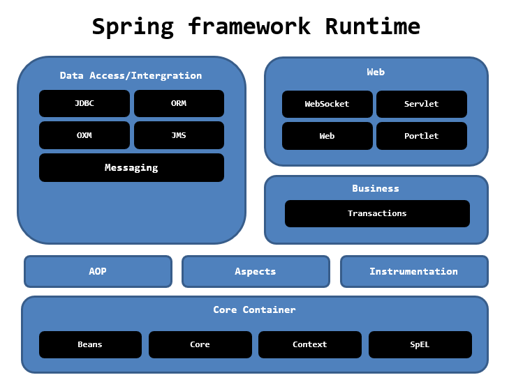
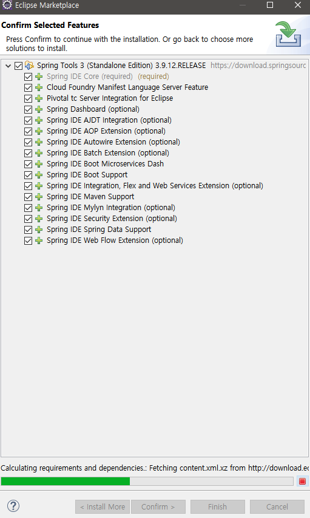
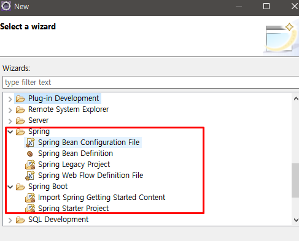
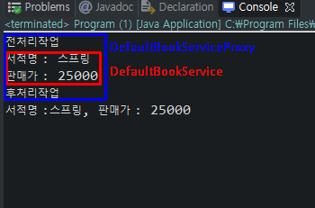

# Java Spring FrameWork


---
## Setup


eclipe market place - STS - Spring Tool 3<br/>


SpringFrame이 설치되어있는지 확인<br/>


---
## reflect

자바 프로그래밍의 기능을 담당하는 메서드를 호출하기 위해서 메서드에대한 명세를 알아야한다.
그러나 때때로 명세를 알 수 없는 상태에서 객체를 참조해야하는 상황에 클래스정보를 분석해내는 기법을
`reflection`이라고 한다.

객체를 이용하여 객체구조 파악, 멤버 정보 취득등을 통해 참조할 수 있게된다.

```java
package reflection

public class UserInfo{
    private String name;
    private int age;

    public UserInfo(String name, int age) {
        this.name = name;
        this.age = age;
    }
}
```

```java
UserInfo ui = new UserInfo("홍길동", 20);
Class<?> cls = ui.getClass();
//RunTime에 Class 정보를 얻어오기

Class<?> cls2 = UserInfo.class;
//CompileTime에 Class를 이용해서 Class를 직접사용

//오직 선언된 해당클래스의 멤버만 가져온다.
cls.getDeclaredFields();

//cls.getFields = 상속받은 멤버까지 얻어냄

```
`getDeclaredFields`를 통해 Field 배열을 받아온다.
```java
Field[] fields = cls.getDeclaredFields();
		
//클래스 필드의 모든 멤버 읽어온다.
for(Field field : fields) {
    System.out.println(field.getName());
}

//클래스 매서드를 읽어온다.
Method[] methods = cls.getDeclaredMethods();
for(Method method : methods) {
    System.out.println(method.getName());
}

//클래스 생성자를 가져온다.
Constructor[] constructors = cls.getDeclaredConstructors();
for(Constructor constructor : constructors ) {
    System.out.println(constructor.getName());
}
```
생성자는 클래스내에서 이름이 같으므로

인수타입으로 찾는다.

`constructor = cls.getDeclaredConstructor(String.class, int.class);`

```java
Constructor<?> constructor = cls.getDeclaredConstructor(String.class, int.class);
member = (Member) constructor.newInstance("홍길동", 20);
//new를 통해서 얻은 member를 newInstance하는 것은 delcrared되었기 때문에 위와같은 방식으로 newInstance를 해준다.
```

---

## invoke
```java
public static void main(String[] args) {
    Member member = new Member("홍길동", 20);
    Class<?> cls = member.getClass();
    
    try {
        //class를 reflect로 얻어낸 값을 통해
        Method method = cls.getDeclaredMethod("setName", String.class);
        
        //arg 1 = Object type
        //arg 2 = 해당 class의 args
        method.invoke(member, "심청이");
        
        //private 되어있어도 다 찾는다
        //private를 없애기도 함
        //getter와 setter도 필요없다.
        
        //홍길동이였던 member는 심청이로 바뀐다.
    } catch (NoSuchMethodException | SecurityException | IllegalAccessException | IllegalArgumentException | InvocationTargetException e) {
        // TODO Auto-generated catch block
        e.printStackTrace();
    }
}
```
`new` 를 통해 만들어낸 `Object`의 `setter`를 안쓰고 `invoke`를 쓰는 이유
해당 `Object class`의 메서드나 생성자를 new 를 통한 `Object`를 통해 호출한다면

해당 매서드를 통한 무언가의 작업을 하기위해서 해당 클래스를 열어봐야한다

그러나 `invoketion`을 통해 열게된다면 `invoke try`절에서 해당 작업을 수행하면된다.

```java
// 전처리
method.invoke();
// 후처리

===

print() {
    // 전처리 
    기능수행
    // 후처리
}
```
하지만 `invoketion`을 사용하면 모든 `Method`에 대해서 대응되지 못한다.
모든 메서드에 대응하게 하려면 `invoke` 절을 `Method`마다 다짜주어야한다.
사용 또한 복잡하다.

---
## Dynamic Proxy
대리자의 역할 멤버를 대신하는 역할의 `instance`를 생성하여 사용


`interface implements class -> program`
```java
BookService bookService = new DefaultBookService("스프링", 25000);
bookService.print();
```
`interface implements class -> Proxy class -> program`
```java
//DefaultBookService의 대리자 역할을 하는 DefaultBookServiceProxy를 생성.
BookService bookService = new DefaultBookServiceProxy("스프링", 25000);
bookService.print();
```

`DefaultBookServiceProxy - `
```java

public class DefaultBookServiceProxy extends DefaultBookService {
	
	public DefaultBookServiceProxy() {}
	public DefaultBookServiceProxy(String title, int price) {
		super(title, price);
	}
	//DefaultBookService의 print를 Overloading 하여 +a 작업 수행
	public void print() {
		System.out.println("전처리작업");
		//이전의 전처리 작업을 여기서 수행
		super.print();
		//이후의 후처리 작업을 여기서 수행
		System.out.println("후처리작업");
	}
}
```
결과 수행<br/>


하지만 구현이 복잡하고 클래스기반의 Proxy는 생성하지 못하는 단점이 있다.