# Dependency Injection
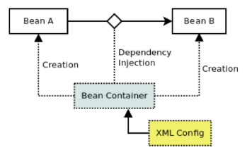

pom.xml에서 
Spring-Context
Spring-Bean
dependency에 추가.
```xml
<dependencies>
    <dependency>
      <groupId>junit</groupId>
      <artifactId>junit</artifactId>
      <version>4.11</version>
      <scope>test</scope>
    </dependency>
    <!-- https://mvnrepository.com/artifact/org.springframework/spring-context -->
		<dependency>
			<groupId>org.springframework</groupId>
			<artifactId>spring-context</artifactId>
			<version>5.2.7.RELEASE</version>
    </dependency>
    <!-- https://mvnrepository.com/artifact/org.springframework/spring-beans -->
		<dependency>
			<groupId>org.springframework</groupId>
			<artifactId>spring-beans</artifactId>
			<version>5.2.7.RELEASE</version>
		</dependency>
  </dependencies>
```
`create a new spring bean Definition file`을 통해 Bean객체를 생성할 xml 생성
`Spring Bean Configuration` 파일에 `Spring Bean` 객체 생성
생성된 `Bean` 객체는 `IoC(Bean Container)`에 저장
`SpringFrameWork`가 `IoC` 컨테이너의 `Bean` 객체를 이용하여 객체 생성


이 역할을 `ApplicationContext`가 수행

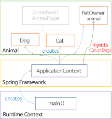

---
`Bean.xml`설정을 통해 `Bean` 객체를 생성하는 모습

Bean 객체의 id를 통해 해당 class의 setter에 값 대입
```xml
<bean id="test" class="com.spring.entitiy.Test">
    <property name="kor" value="100">
</bean>
```

`Bean` 객체의 `id`를 통해 해당 `class`의 `constructor`에 값 대입
```xml
<bean id="test" class="com.spring.entity.Test">
    <constructor-arg name="kor" value="100"/>
</bean>

```

자료형이 기본자료형이 아니라면 `value`가 아닌 `ref`를 활용하자.
```xml
<bean id="testPrint" class="com.spring.entity.TestPrint">
    <constructor-arg ref="test">
</bean>
```
```java
public class TestPrint implements DefaultPrint {
    private Test test;
    public TestPrint(Test test) {
        this.test = test;
    }
}
```
`FileSystemXmlApplicationContext` : 현 클래스 폴더 위치에서 검색 
`ClassPathXmlApplicationContext` : 프로젝트에서 사용하는 패키지 경로로 검색

`Main-`
```java
ApplicationContext ctx = ClassPathXmlApplicationContext("AppContext.xml");
Test test1 = (Test)ctx.getBean("test");
//Test = bean id name
//Bean 객체를 xml에서 꺼내온 모습.
```
이전 `invoke`와 `reflect` 하던 역할의 `interface`를 `Spring-context`가 대신한다.


---
Constructor-arg : c namespace
xmlns:c ="http://www.springframework.org/schema/c"
```xml
<bean id="testPrint" class="com.spring.entity.TestPrint" c:test-ref="test">
</bean>
```

Property : p namespace
xmlns:p ="http://www.springframework.org/schema/p"
```xml
<bean id="testPrint" class="com.spring.entity.TestPrint" p:kor="100">
</bean>
```

# Spring framework collection
## ArrayList
```xml
<util:list id="list" value-type="java.lang.String"> 
    <value>홍길동</value>
    <value>이순신</value>
    <value>강감찬</value>
</util:list>

```
```java
ApplicationContext ctx = new ClassPathXmlApplicationContext("AppContext.xml");
List<?>list = ctx.getBean("list", List.class);
for(Object str : list) {
    System.out.println(str);
}
```
---
## Hashmap
```xml
<util:map id="아이디" key-type="키타입" value-type="객체타입">
    <entry>
        <key>
            <value>one</value>
        </key>
        <value>20</value>
    </entry>
    <entry>
        <key>
            <value>키</value>
        </key>
        <value>값</value>
    </entry>
    <entry>
        <key>
            <value>키</value>
        </key>
        <ref bean="객체"/>
        <!--들어가는 객체 타입에 유의하자 -->
    </entry>
</util:map>
```

```java
ApplicationContext ctx = new ClassPathXmlApplicationContext("AppContext.xml");
Map map = ctx.getBean("map", Map.class);
System.out.println(map.get("one"));
```
```java
ApplicationContext ctx = new ClassPathXmlApplicationContext("AppContext.xml");
		
Person p1 = ctx.getBean("person", Person.class);
Person p2 = ctx.getBean("person", Person.class);
//Spring Bean의 생명주기 = SingleTon
p1.setName("심청이");
//p1이 바뀌면 p2도 바뀐다.
System.out.println(p1);
System.out.println(p2);
```
```xml
<bean id="person" class="beantest.Person" scope="prototype"> <!-- 기존의 singleton 이던 범위를 바꾼다. -->
    <property name="name" value="홍길동"/>
    <property name="age" value="20"></property>
</bean>
```
---
## Set
```xml
<util:set id="아이디" [value-type="저장객체타입"]>
    <value>값</value>
    <ref bean="객체"/>
</util:set>
```

```java
Set set = (Set)ctx.getBean("set");
Iterator it = set.iterator();
while(it.hasNext()) {
    Object obj = it.next();
    System.out.println(obj);
}
```
---
## Properties
```xml
<util:properties id="env">
    <prop key="number">10</prop>
    <prop key="pi">3.13</prop>
    <prop key="name">홍길동</prop>
</util:properties>
``` 
Properties는 Key와 Value가 String이다.
```java
ApplicationContext ctx = new ClassPathXmlApplicationContext("main/AppContext.xml");
Properties prop = (Properties)(ctx.getBean("env"));
System.out.println(prop.get("name"));
System.out.println(prop.get("pi"));
System.out.println(prop.get("number"));
```
---
# Spring Bean LifeCycle

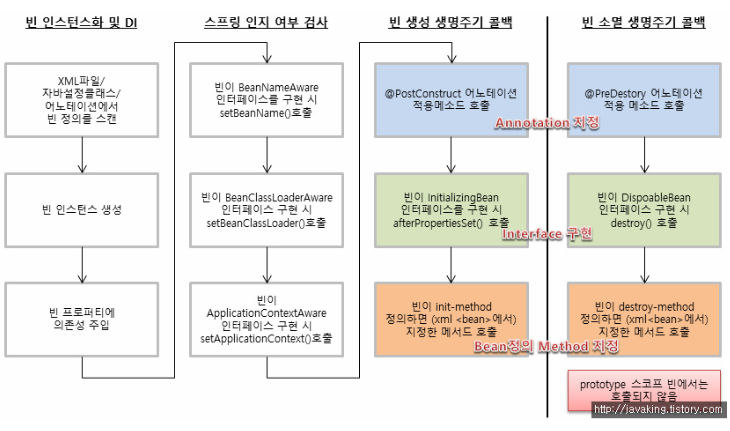
Context 생성 직후

`Bean` 객체 생성 Listener
`Initializing interface`
 

`Bean` 객체 소멸 Listener
`DeposableBean interface`

```java
public class Person implements InitializingBean, DisposableBean{
    @Override
	public void destroy() throws Exception { //객체 소멸 직전
		System.out.println(this + "객체 소멸 직전");
	}
	@Override
	public void afterPropertiesSet() throws Exception { // 객체가 생성되고 난 후
		System.out.println(this + "객체 생성 직후");
		
    }
}
```
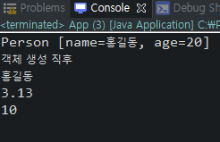

소멸을 확인하려면 application을 종료해야 확인가능하다 xml에서 받아온 상수는 직접 닫지 못하고
해제등록하여 등록해제 할 수 있다.
```java
public static void main(String[] args) {
ApplicationContext ctx = new ClassPathXmlApplicationContext("main/AppContext.xml");
((AbstractXmlApplicationContext)ctx).registerShutdownHook(); //ctx 형변환
                                                            //application 종료 hooking
}
```
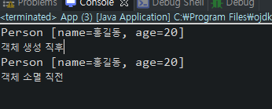<br/>
ApplicationDestroy하는 순간을 hook 하여 destroy를 띄워냈다.

```xml
<bean id="person" class="beantest2.Person" init-method="init" destroy-method="destroy">
```
생성 메서드와 소멸 메서드를 커스텀으로 호출하게 할 수 있다.
```java
public void destroy() throws Exception {
    System.out.println(this + "객체 소멸");
}

public void init() throws Exception { 
    System.out.println(this + "객체 생성");
}
```

---
와중에 Java SE-11 unbound 로 고생했다.

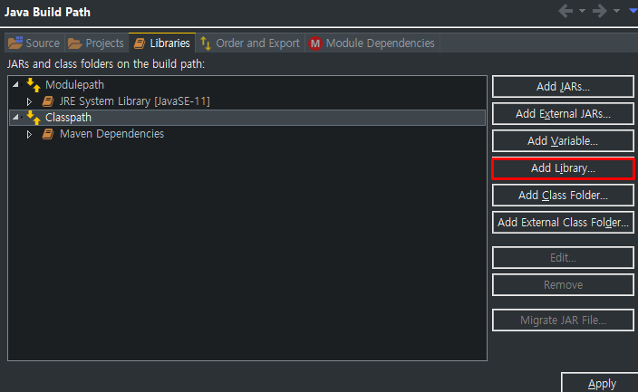
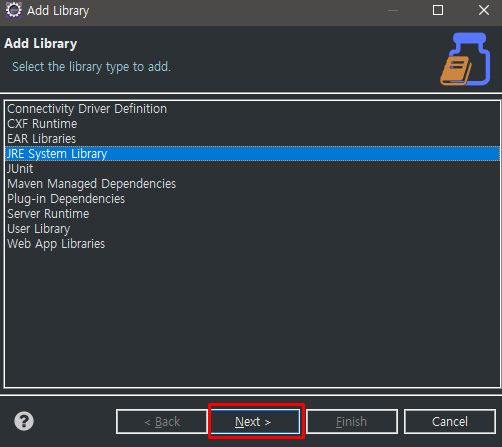
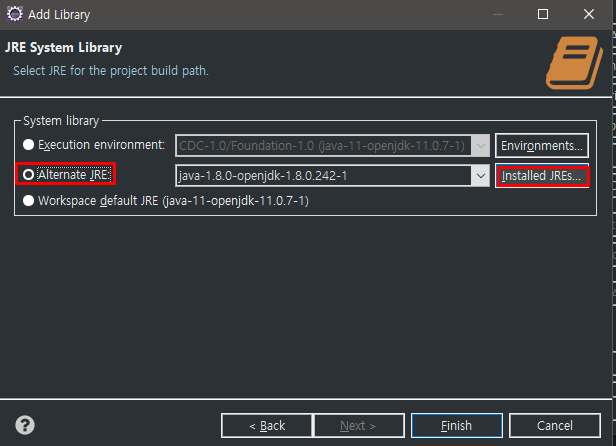
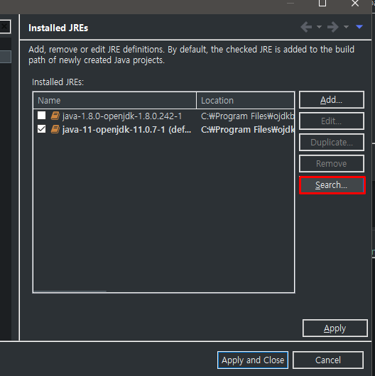
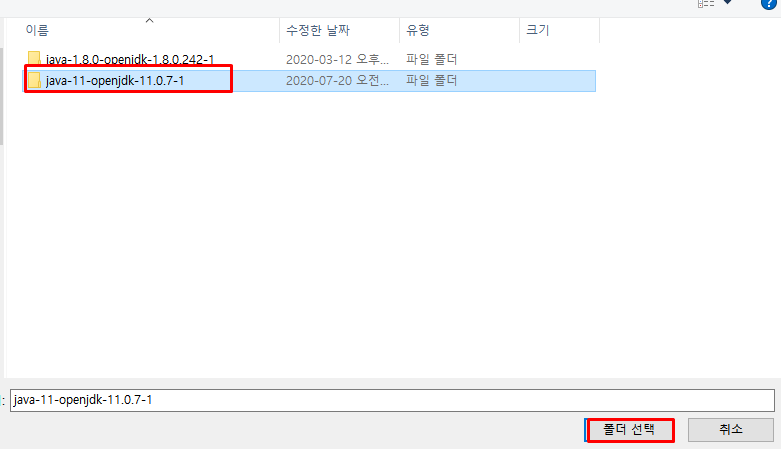
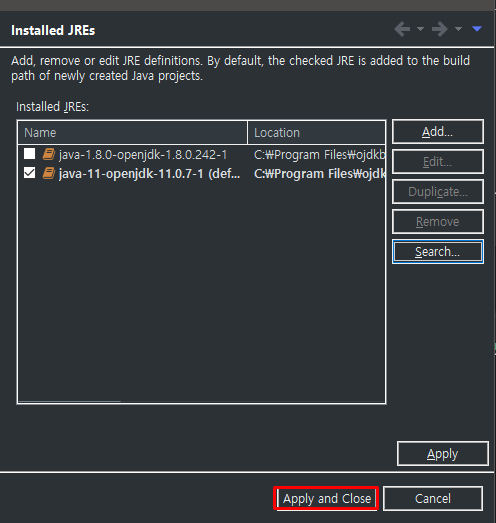

---
# XML import
`BeanContext.xml 생성`
```xml
<?xml version="1.0" encoding="UTF-8"?>
<beans xmlns="http://www.springframework.org/schema/beans"
	xmlns:xsi="http://www.w3.org/2001/XMLSchema-instance"
	xsi:schemaLocation="http://www.springframework.org/schema/beans http://www.springframework.org/schema/beans/spring-beans.xsd">
	<bean id="person2" class="beantest2.Person">
	<property name="name" value="심청이"></property>
	<property name="age" value="16"></property>
	</bean>
</beans>
```
`AppContext.xl에서 import를 통한 BeanContext의 bean 객체 사용`
```xml
<?xml version="1.0" encoding="UTF-8"?>
<beans xmlns="http://www.springframework.org/schema/beans"
	xmlns:xsi="http://www.w3.org/2001/XMLSchema-instance"
	xmlns:util="http://www.springframework.org/schema/util"
	xsi:schemaLocation="http://www.springframework.org/schema/beans http://www.springframework.org/schema/beans/spring-beans.xsd
		http://www.springframework.org/schema/util http://www.springframework.org/schema/util/spring-util-4.3.xsd">
	
	<import resource="BeanContext.xml"/>
	
	<bean id="person1" class="beantest2.Person">
		<property name="name" value="홍길동"></property>
		<property name="age" value="20"></property>
	</bean>
</beans>
```
```java
public static void main(String[] args) {
    ApplicationContext ctx = new ClassPathXmlApplicationContext("main/AppContext.xml");
    Person p = ctx.getBean("person1", Person.class);
    Person p2 = ctx.getBean("person2" , Person.class);
    System.out.println(p);
    System.out.println(p2);
    
}
```
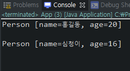

---
# Annotation DI
## @Autowired
`Bean`으로 객체를 초기화 하던 `LectureTest`를 `Annotation`으로 값을 받게 만들자
```java
private LectureTest test;

public void setTest(LectureTest test) {
    this.test = test;
}

public void print() {
    System.out.println("국어 : " + test.getKor());
    System.out.println("영어 : " + test.getEng());
    System.out.println("수학 : " + test.getMath());
}
```
```xml
<bean id="LectureTest" class="annotationInject.LectureTest">
    <property name="kor" value="50"></property>
    <property name="eng" value="80"></property>
    <property name="math" value="70"></property>
</bean>

<bean id="board" class="annotationInject.ScoreBoard">
    <property name="test" ref="LectureTest"/>
    <!-- setTEst에 LectureTest Bean 객체를 받아와 초기화 하고있다. -->
</bean>
```
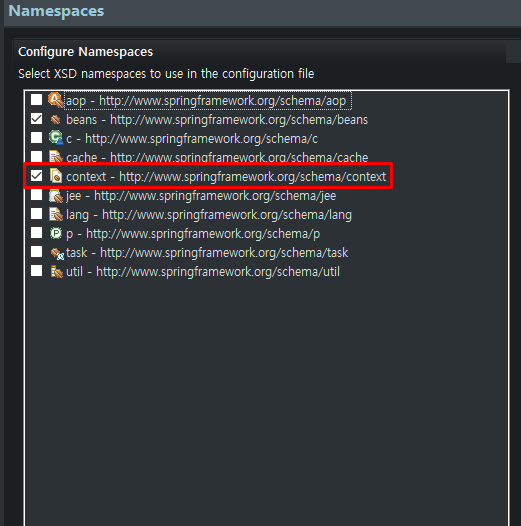

```java
public class ScoreBoard {
	
	@Autowired
	private LectureTest test;
	
	public void setTest(LectureTest test) {
		this.test =test;
	}
	
	public void print() {
		System.out.println("국어 : " + test.getKor());
		System.out.println("영어 : " + test.getEng());
		System.out.println("수학 : " + test.getMath());
	}
}
```
```xml
<context:annotation-config/> 
<!-- 추가된 annotation-config가 Autowired를 인식하여
Bean에서 setter를 불러오지 않아도 annotation을 찾아온다
reflection injection을 통해 annotation이 붙어있는 field를 불러와 넣어준다. -->

<bean id="LectureTest" class="annotationInject.LectureTest">
    <property name="kor" value="50"></property>
    <property name="eng" value="80"></property>
    <property name="math" value="70"></property>
</bean>

<bean id="board" class="annotationInject.ScoreBoard"/>
```
```java
public class ScoreBoard {
	
	@Autowired
	private LectureTest test;
	
	public void print() {
		System.out.println("국어 : " + test.getKor());
		System.out.println("영어 : " + test.getEng());
		System.out.println("수학 : " + test.getMath());
	}
}
```
---
## @Qualifier
```xml
<bean id="LectureTest" class="annotationInject.LectureTest">
		<property name="kor" value="50"></property>
		<property name="eng" value="80"></property>
		<property name="math" value="70"></property>
	</bean>
<bean id="secondTest" class="annotationInject.LectureTest"/>
```
```java
Unsatisfied dependency expressed through field 'test'; nested exception is org.springframework.beans.factory.NoUniqueBeanDefinitionException: No qualifying bean of type 'annotationInject.LectureTest' available: expected single matching bean but found 2: LectureTest,secondTest
// 하나의 class에 대해 두개의 bean이 사용하고 있다는 오류창
```

```java
public class ScoreBoard {
	
	@Autowired
	@Qualifier("LectureTest")//xml에서 LectureTest가 id인 bean을 주입해준다.
	private LectureTest test;
	
	public void print() {
		System.out.println("국어 : " + test.getKor());
		System.out.println("영어 : " + test.getEng());
		System.out.println("수학 : " + test.getMath());
	}
}
```
해당의 `annotation`으로 인해 더 이상 오류가 뜨지 않는다

|-주의!|
|-|
`@Autowired`을 생성자에 사용 할 때에는 `@Qualifier`를 사용할 수 없다.
생성자는 `setter()`와 달리 인수를 여러개 전달 받을 수 있으며 전달받은 여러개의 인수가 모두 동일한 타입일 수 있기 때문...

```java
@Qualifier("LectureTest")
public Student(Jumsu jumsu1, Jumsu jumsu2) {}
//이와 같은 경우 jumsu1에도 jumsu2에도 값이 들어간다.
//다른 두 Jumsu 타입의 인수를 받아오는 의미가없어진다
//기껏가져왔는데 값이 같아짐 ㄷㄷ
```
만약 두개의 인수에대해서 LectureTest `Bean` 객체를 넣고싶다면

```java
@Qualifier("LectureTest")
private LectureTest test1;
	
@Qualifier("secondTest")
private LectureTest test2;
```
때문에 값이 같아지지 않게 멤버에서 `annotation`을 부르거나

```java
public Student(
    @Qualifier("LectureTest")Jumsu jumsu1, 
    @Qualifier("secondTest")Jumsu jumsu2) {}
```
인자뒤에 `annotation` 을 붙여준다.
그러나 멤버나 `setter()`에서 `annotation`을 부르는게 권장이다.


만약 `@Autowired`로 쓰고있던 `Bean`이 없어진다면 `NoSuchBeanDefinitionException` 이 뜨면서 실행되지않는다
`(required=false)`라는 옵션을 준다면 `@Autowired`가 필수로 입력되지 않아도 된다

```java
@Autowired(required=false)
@Qualifier("LectureTest")
private LectureTest test;
```
이와같은 옵션을 사용하면 일단 `Bean`이 없어도 넘어가므로 `@Autowired`로 값을 받던 멤버는 아무런 값이 오지않고 끝나므로
`NullPointerException`이 발생한다.

---
## @Component
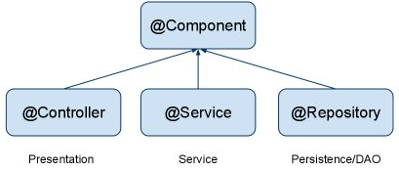
@Controller : Model의 Controller
@Service : Model의 Service
@Repository : Controller에 대해 사용

3개다 Bean에 등록되어 `@Component`로써 사용할 수 있다는점이 같지만 용도에 맞게 쓰는것이 원칙

```java
@Component("LectureTest2") // LectureTest2 라는 이름으로 xml에 올린다.
public class LectureTest {
```
```java
public class ScoreBoard {
	@Autowired(required=false)
	@Qualifier("LectureTest2") // xml에 올린 LectureTest2를 받아온다.
	private LectureTest test;
```
```xml
<context:component-scan base-package="annotationInJect"></context:component-scan>
<!-- annotation 이라는 package내부를 scan 할 수 있도록 xml에 올렸다.-->
```
그러나 `LectureTest2`에 관해서 xml에서 설정을 할 수 가 없으므로 값이 초기화되어 나온다.

이런경우 직접적으로 `@Value` annotation을 통해 값을 지정해준다
```java
@Component("LectureTest2")
public class LectureTest {
	@Value("100")
	private int kor;
	@Value("80")
	private int eng;
	@Value("90")
	private int math;
```
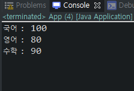

이런게 필요 있을까? 

같은 interface를 받는 @component를 달고있는 class가 여러개있다면

해당 interface를 xml에 받아올때 하위클래스들은 모호성에러가 뜨게된다.

```java
public interface Test {}
```
```xml
<baen id=test class="com.example.Test">
```
```java
@Component
public class A implements Test {} //난가?

@Component
public class B implements Test {} //난듯?
```
```java
public class ScoreBoard {

    @Autowired
    @Qualifier("test")
    Test test;
    //뭐야 뭐 가져오라고 ㅋㅋ
}
```
```java
@Component("A")
public class A implements Test {} //나잖어

@Component("B")
public class B implements Test {}
```
```java
public class ScoreBoard {

    @Autowired
    @Qualifier("A")
    Test test;
    //편-안
}
```

```java

public interface Employee{ int pay() {} }

@Component("partTime")
public class PartTime implements Employee{}

@Component("Regular")
public class Regular implements Employee{}

public interface Manager { 
    void pay() {} 

    void addEmployee(Employee emp) {}
}

@Component("Manager")
public class ManagerImple { void pay() { 구현체 } }
```
1. `Regular, PartTime, ManagerImpl은 Spring Bean을 등록`
2. `Application은 ManagerImple Bean을 취득`
3. `Employee Bean 객체를 다수 취득 ManagerImpl Bean에 사원으로 등록`
        <util:map>
4. `ManagerImpl Bean의 pay() 메서드 이용 임금 지불내용 출력`
        key값으로 하나씩 꺼내오면서 연산

출력 형식 :
```
----------------------------
홍길동  정직원      12000000
심청이  계약직      30000
```
1. `Regular, PartTime, ManagerImpl은 Spring Bean을 등록`
2. 
---
