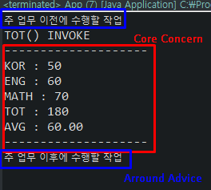

# Java Configuration
## @Configuration
`Spring Bean` 객체 생성을 위한 클래스임을 명시
```java
@Configuration
public class AppConfig {
```

`@Configuration` annotation이 붙은 class 는 `@Bean`을 이용해 `Bean` 객체 생성이 가능해진다.

---
## @Bean
```java
@Bean
@Scope("prototype")
public ArrayList<String> getList() {
    ArrayList<String> list = new ArrayList<>();
    list.add("이순신");
    list.add("강감찬");
    list.add("엄복동");
    
    return list;
}
```
```java
ArrayList<String> x = ctx.getBean("getList", ArrayList.class);		
for(String i : x) {
    System.out.println(i);
}
```
---
# JavaConfiguration 분할
여러개의 JavaConfiguration을 사용한다면 `register`를 이용하여야 한다
```java
public static void main(String[] args) {
		AnnotationConfigApplicationContext ctx = new AnnotationConfigApplicationContext();
		
		ctx.register(javaConfiguration.config.AppConfig.class);
		ctx.register(javaConfiguration.config.SystemConfig.class);	
		ctx.refresh();
		//register을 이용하여 등록했다면
		//refresh를 해주어야 한다.
```
`register`로 등록을 하려면 `refresh()`를 해주어야한다.

---
오늘도 새로운 문제 발생
Eclipse의 코드만 읽어와 vscode에서 코딩만하고 실행을 eclipse로 하는 방식으로 하려하다
문자인코딩이 달라 깨지더라

Eclipse에서 Window -> Preferences<br/>


혹은 vsCode에서 문자셋 변경<br/>


---

---
## JavaConfiguration -> SpringBeanConfiguration
```xml
<bean id="map" class="java.util.HashMap">
    <constructor-arg>
        <map>
            <entry>
                <key><value>국어</value></key>
                <value>90</value>
            </entry>
            <entry>
                <key><value>영어</value></key>
                <value>90</value>
            </entry>
        </map>
    </constructor-arg>
</bean>
```
```java
public static void main(String[] args) {
    ApplicationContext ctx = new ClassPathXmlApplicationContext("spring/config/SpringConfig.xml");
    HashMap map = ctx.getBean(HashMap.class);
    Set keySet = map.keySet();
    Iterator keyIter = keySet.iterator();
    while(keyIter.hasNext()) {
        Object key = keyIter.next();
        System.out.println(key + " : " + map.get(key));
    }
}
```
---
## SpringBeanConfiguration -> JavaConfiguration
기존 : Spring.xml -> Java
```java
@Configuration
public class JavaConfig {
```
`Main -`
```java
ApplicationContext ctx = new ClassPathXmlApplicationContext("spring/config/SpringConfig.xml");
```
```xml
<context:annotation-config/>
<bean class="spring.config.JavaConfig"/>
```
`XML`에 설정되어있는 `annotation-config` -> `Bean`의 `Class` 중
`@Configuration` 이 달려있는 `Class`를 찾는 방법으로 가져온다.

<br/>

현재 : ((Spring.xml) <- Import | JavaConfiguration.java) -> Java
```java
@ImportResource("classpath:spring/config/SpringConfig.xml")
public class JavaConfig {
```
`Main -`
```java
public static void main(String[] args) {
    ApplicationContext ctx = new AnnotationConfigApplicationContext(spring.config.JavaConfig.class);
    
    HashMap map = ctx.getBean(HashMap.class);
    Set keySet = map.keySet();
    Iterator keyIter = keySet.iterator();
    while(keyIter.hasNext()) {
        Object key = keyIter.next();
        System.out.println(key + " : " + map.get(key));
    }
}
```
`JavaConfig.java`에서 `XML`을 `Import`하여 `Main`에서는 `JavaConfig.java`만 읽어와도 
내부에 `XML`이 import되어있기 때문에 `XML`의 `HashMap` 까지 읽어올 수 있다.

---

### @ComponentScan
```java
@ComponentScan("spring")
//== <context:component-scan base-package="spring"></context:component-scan>
```
`@ComponentScan`을 통해 하위의 클래스를 뒤지면서 `@Component`가 붙어있는 클래스의 `Bean`객체를 생성한다

---
# AOP(Aspect Oriented Programming)
`Application`의 기능을 분리하여 `Aspect`라는 
`Module`형태로 만들어 설계

즉 핵심기능(Core Concerns)에서 부가기능(Cross-cutting Concerns)을 분리함으로써 핵심기능을 설계하고 구현할 때 객체지향적인 가치를 지킬 수 있도록 도와주는 개념


## Around Advice
`Core concern`을 수행하기 이전과 이후에 작업을 추가하는 방식

`Core concern`
```java
public static void main(String[] args) {
    ApplicationContext ctx = new ClassPathXmlApplicationContext("AOP/AppContext.xml");
    //Core concern 객체 생성
```
`Target`에 제공할 부가기능 `Cross-cutting Concerns`
```java
@Component("arroundLog")
public class ArroundLog implements MethodInterceptor {
//Cross-cutting concert
	@Override
	public Object invoke(MethodInvocation invocation) throws Throwable {
		Object obj = null;
		System.out.println("주 업무 이전에 수행할 작업");
		obj = invocation.proceed();
		System.out.println("주 업무 이후에 수행할 작업");
		return obj;
	}
}
```
ProxyBean에 의해서 생성되는 Proxy 객체
```xml
<bean id="proxy" class="org.springframework.aop.framework.ProxyFactoryBean">
	<property name="target" ref="LectopiaTest"/>
	<property name="interceptorNames">
		<list>
			<value>arroundLog</value>
		</list>
	</property>
</bean>
```
`Main`
```java
    //Proxy 객체 생성
    Test test = ctx.getBean("proxy", Test.class);
    test.print();
    int tot =test.tot();
    System.out.println("TOTINNOKE: " + tot);
}
```

---
## Before Advice
수행 이전에 `Cross-cutting concern` 을 추가하는 방식

```java
@Component("beforeLog")
public class BeforeLog implements MethodBeforeAdvice {

	@Override
	public void before(Method method, Object[] args, Object target) throws Throwable {
		//method : 호출 메서드 , args : 호출 시 주어진 인수 , target : 메서드 호출 주체
		//전처리 작업 작성
		System.out.println("메서드 호출 전에 수행할 코드");
		System.out.println("메서드 호출 : " + method.getName());
		System.out.println("호출 인수 개수 : " + args.length);
		System.out.println("Core 객체 타입 : " + target.getClass().getName());
	}
}
```
```xml
<bean id="proxy" class="org.springframework.aop.framework.ProxyFactoryBean">
	<property name="target" ref="LectopiaTest"/>
	<property name="interceptorNames">
		<list>
			<value>beforeLog</value>
		</list>
	</property>
</bean>
```


---
## After Returning Advice
```java
@Component("afterReturningLog")
public class AfterReturningLog implements AfterReturningAdvice {

	@Override
	public void afterReturning(Object returnValue, Method method, Object[] args, Object target) throws Throwable {
		System.out.println("Core Concern 수행 후 수행할 코드 작성");
		System.out.println("수행 결과 : " + returnValue);
		System.out.println("호출 메서드 명 : " + method.getName());
		System.out.println("호출 인수의 수 : " + args.length);
		System.out.println("Core Concern 의 타입" + target.getClass().getName());
	}

}
```
```xml
<bean id="proxy" class="org.springframework.aop.framework.ProxyFactoryBean">
	<property name="target" ref="LectopiaTest"/>
	<property name="interceptorNames">
		<list>
			<value>afterReturningLog</value>
		</list>
	</property>
</bean>
```


---
## After Throwing Advice

---

## PointCut, Join Point, Weaving

```xml
<!-- 실행 가능한 pointCut -->
<!-- 메서드의 Signature를 비교하여 타겟 메서드 선별 -->
<bean id="printPointCut" class="org.springframework.aop.support.NameMatchMethodPointcut">
	<property name="mappedName" value="print"/>
</bean>
```
```xml
<!-- advice가 적용될 위치 설정 현재는 beforeAdvice -->
<bean id="avgPointCut" class="org.springframework.aop.support.DefaultPointcutAdvisor">
    <!-- Weaving 삽입될 위치에 부가기능 삽입 -->
	<property name="advice" ref="beforeLog"/>
	<property name="pointcut" ref="printPointCut"/>	
</bean>
```
```xml
<!-- Proxy의 타겟 객체가 구현한 인터페이스의 pointCut 메서드의 위치는  
join point가 되어 pointCut의 메서드가 들어간다. -->
<bean id="proxy" class="org.springframework.aop.framework.ProxyFactoryBean">
	<property name="target" ref="LectopiaTest"/>
	<property name="interceptorNames">
		<list>
			<value>avgPointCut</value>
		</list>
	</property>
</bean>
```
`PointCut` 만들고
`Join Point`로 위치설정
`Proxy`로 실행.

---
### Advice의 간소화
PointCut + Join Point = 
```xml
<!-- 실행 가능한 pointCut -->
<!-- 메서드의 Signature를 비교하여 타겟 메서드 선별 -->
<bean id="printPointCut" class="org.springframework.aop.support.NameMatchMethodPointcut">
	<property name="mappedName" value="print"/>
</bean>
```
```xml
<!-- advice가 적용될 위치 설정 현재는 beforeAdvice -->
<bean id="avgPointCut" class="org.springframework.aop.support.DefaultPointcutAdvisor">
	<property name="advice" ref="beforeLog"/>
	<property name="pointcut" ref="printPointCut"/>	
</bean>
```

Advisor
```xml
<bean id="PointCutAdvisor" class="org.springframework.aop.support.NameMatchMethodPointcutAdvisor">
    <!-- 이 부분이 Join Point 설정-->
    <property name="advice" ref="beforeLog"/>
    <!-- 이 부분이 pointCut-->
	<property name="mappedName" value="print"/>
</bean>
```
여러개의 메서드에 `Weaving`을 수행할 메서드명 지정.
```xml
<property name="mappedName">
    <list>
        <value>print</value>
        <value>tot</value>
    </list>
</property>
```

---
# SpringJDBC
|동작|Spring|개발자|
|:-:|:-:|:-:|
|연결 파라미터 정의||O|
|데이터베이스 연결|O||
|SQL문 지정||O|
|파라미터 선언과 파라미터 값의 제공||O|
|Statement 준비와 실행|O||
|결과에 대한 반복작업 설정|O||
|각 이터레이셔에 대한 작업 수행||O|
|모든 예외처리|O||
|트랜젝션 제어|O||
|Statement close|O||
|ResultSet close|O||

<br/>

|준비과정|
|-|

1. DB 생성
2. `pom.xml`에 `spring-context`와 `spring-jdbc`, `mariadb-java-client` import
3. AppContext.xml에서 추가
`AppContext.xml - `
```xml
<bean id="dataSource" class="org.springframework.jdbc.datasource.DriverManagerDataSource">
    <property name="driverClassName" value="org.mariadb.jdbc.Driver"/>
    <property name="url" value="jdbc:mariadb://localhost:3306/spring4s"/>
    <property name="username" value="spring5"/>
    <property name="password" value="1234"/>
</bean>

<bean id="jdbcTemplate" class="org.springframework.jdbc.core.JdbcTemplate">
    <property name="dataSource" ref="dataSource"/>
</bean>
```

4. `DAO`의 `interface`에 `@Component` 추가
`MembersDAO.interface - `
```java
@Repository("MembersDAO") //쓰임은 같지만 의미는 다름
```

5. `AppContext.xml`에서 `annotation`을 읽어오기위한 작업
`AppContext.xml -`
```xml
<context:annotation-config/>
<context:component-scan base-package="jdbc"/>
```


---
오늘의 뻘짓
src 외부의 파일의 경로 읽어올때


addFolder -> 해당파일체크 후 -> ok
로 추가해주어야한다

---

