****# JDBC
DB TABLE 생성
```sql
CREATE TABLE member (
email VARCHAR(100) NOT NULL PRIMARY KEY,
pass VARCHAR(100) NOT NULL,
nick VARCHAR(100) NOT NULL,
registeredAt DATETIME NOT NULL DEFAULT CURRENT_TIMESTAMP,
removeAt DATETIME NULL DEFAULT NULL
)ENGINE INNODB DEFAULT CHARSET=UTF8;
```
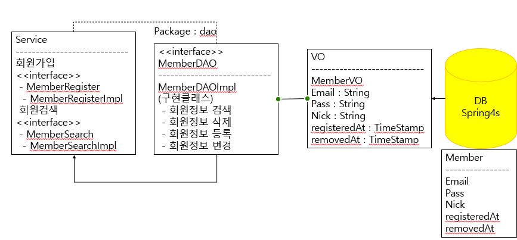

`MemberVO`
```java
public class MemberVO {
	private String email;
	private String pass;
	private String nick;
	private Timestamp registeredAt;
    private Timestamp removedAt;

    //getter, setter, constructor
```
`MemberDAO <<interface>>`
```java
public interface MemberDAO {
	void insert(MemberVO member) throws Exception;
	void update(MemberVO member)throws Exception;
	void delete(String email)throws Exception;
	MemberVO selectByEmail(String email)throws Exception;
	MemberVO selectByEmailPass(String email, String pass)throws Exception;
}
```
`implemnet`
```java
@Repository("memberDAO")
public class MemberDAOImpl implements MemberDAO {
```
`MemberRegister(Service) <<interface>>`
```java
public interface MemberRegister {
	void execute() throws Exception;
}
```
`implement`
```java
@Service("memberRegister")
public class MemberRegisterImpl implements MemberRegister {
```
---
## JdbcTemplate
`DataSource`를 멤버로 가지며 `DataSource`를 이용하여 데이터베이스에 대한 작업을 쉽게 할 수 있도록 기능제공

`Statement`생성과 실행같은 `JDBC` 핵심 작업을 수행 `SQL`문을 실행하거나 `ResultSet`에 대한 반복적인 값의 작업을 수행

---
## RowMapper
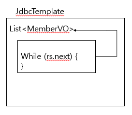
`RowMapper` 내부에서 자체적으로 `ResultSet` 을 돌려준다.
```java
members = temp.query(sql, new RowMapper<MemberVO>() {
    @Override
    public MemberVO mapRow(ResultSet rs, int rowNum) throws SQLException {
        return new MemberVO(
                rs.getString("email"),
                rs.getString("pass"),
                rs.getString("nick"),
                rs.getTimestamp("registeredAt"),
                rs.getTimestamp("removedAt"));
    }
});
return (members.size() == 0 ? null : members.get(0));
```
해당 `interface`와 구현 `service` 생성

`RowMapper`는 `interface` 이므로 사용자의 쓰임에 맞게 구현체 `class` 구성 후 사용
```java
public class MemberVOMapper implements RowMapper<MemberVO>{
//RowMapper는 타입미지정시 Object로 인식하기 때문에 MemberVO로 지정해주어야한다.
	@Override
	public MemberVO mapRow(ResultSet rs, int rowNum) throws SQLException {
		return new MemberVO(
				rs.getString("email"),
				rs.getString("pass"),
				rs.getString("nick"),
				rs.getTimestamp("registeredAt"),
				rs.getTimestamp("removeAt"));
	}
}
```
`사용 `
```java
public MemberVO selectByEmail(String email) throws Exception {
    List<MemberVO> members = null;
    String sql ="SELECT * FROM members WHERE email='"+email+"'";
    members = temp.query(sql, new MemberVOMapper());
    return (members.size() == 0 ? null : members.get(0));
}
```
```java
//members = temp.query(sql, new MemberVOMapper());
members = temp.query(sql, new BeanPropertyRowMapper<MemberVO>(MemberVO.class));
//만약 DB와 VO의 멤버명이 같다면 BeanPropertyRowMapper를 이용 이름이 같은 멤버들을 인식하여 받아와준다
```
---
## PreparedStatementCreator
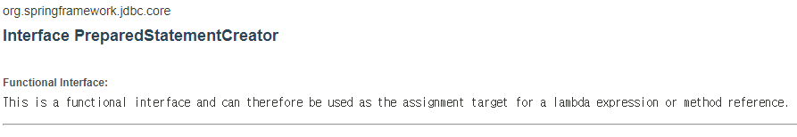
`ResultSet`을 이용하지 않고 `PreparedStatement`로 바로 받아올 수 있게 해주는 `interface`
```java
members = temp.query(new PreparedStatementCreator() {
    @Override
    public PreparedStatement createPreparedStatement(Connection con) throws SQLException {
        PreparedStatement pstmt = con.prepareStatement("SELECT * FROM members WHERE email=? AND pass=?");
        pstmt.setString(1, email);
        pstmt.setString(2, pass);
        return pstmt;
    }
},
new MemberVOMapper());
```

`Custom PreparedStatementCreator`
```java
public class SelectByEmailPassPstmtCreator implements PreparedStatementCreator{
	private String email;
	private String pass;
	public SelectByEmailPassPstmtCreator(String email, String pass) {
		this.email = email;
		this.pass = pass;
	}
	@Override
	public PreparedStatement createPreparedStatement(Connection con) throws SQLException {
		PreparedStatement pstmt = con.prepareStatement("SELECT * FROM members WHERE email=? AND pass=?");
		pstmt.setString(1, email);
		pstmt.setString(2, pass);
		return pstmt;
	}
}
```
---
## Custom Exception
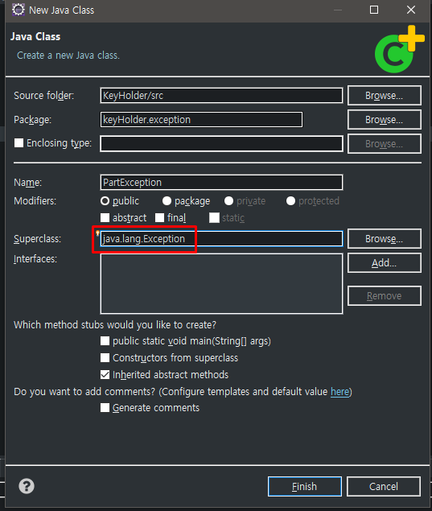

```java
public abstract class PartException extends RuntimeException {
	//RuntimeException은 JVM이 관여한다.
	//추상화하여 new를하지 못하게 만듬
	public PartException(String message) {
		super(message);
	}
}
```
```java
public static void func() throws PartException{
    //RuntimeException은 throws를 안해주어도 되지만
    //Exception 발생 시 JVM이 관여하기 때문에
    //Throws를 처리해주는것이 좋다.

    //RuntimeException은 개발자가 아닌 JVM이 처리를 할 수 있기 때문에
    //Exception처리가 의무가 아니게된다.
    throw new PartInputException();
}
```
`사용`
```java
public interface PartDAO {
	void insert(PartVO part) throws PartException;
	void update(PartVO part)throws PartException;
	void delete(int partId)throws PartException;
	PartVO selectById(int partId)throws PartException;
	PartVO selectByName(String partName)throws PartException;
}
```
현재 `partId`는 DB에서 `AUTO_INCREMENT`로 `DEFAULT`함수를 통해 generate되어진다.
그러므로 개발자는 `partName`의 `partId`를 알 수 없으므로
jdbc에서 `partId`를 이용하여 Part를 찾을 수 없다.

```java
@Override
public PartVO selectById(int partId) throws PartException {
    //partId같은 경우는 DB에서 알아서 generate되어지게 설정하였기 때문에 partId를 select할 수 없다.
    //keyHolder를 이용한다.
    return null;
}
```


---
## KeyHolder
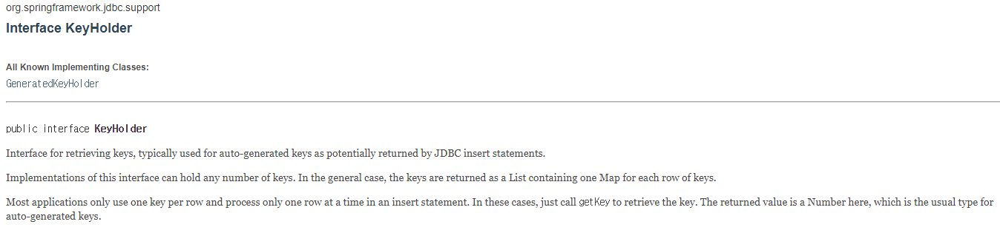
```java
@Override
	public boolean insert(PartVO part) throws PartException {
		boolean result = false;
		KeyHolder holder = new GeneratedKeyHolder();

		int effectedRow = jTemp.update(new PartInsertCreator(part, new String[] { "partId" }), holder);
		//update안에 있는 KeyHolder에 column의 내용이 들어간다.

		if(effectedRow == 0) {
			throw new PartInputException();
		}
		//정상적으로 입력이 되었다면
		//입력된 part의 정보를 Map holder에서 key정보로 key를 받아와서 넣어준다.
		if(effectedRow > 0) {
			Number key = holder.getKey();
			part.setPartId(key.intValue());
			result = true;
		}
		return result;
	}
```
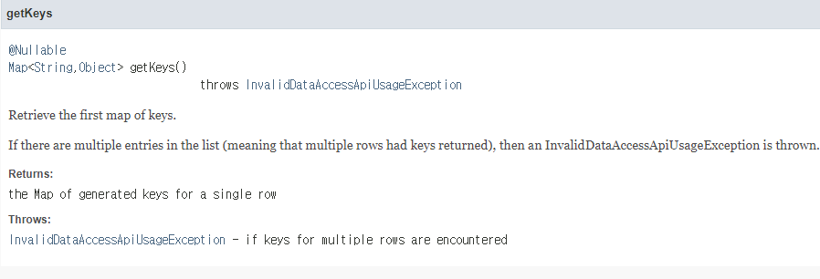

`JdbcTemplate.update()`에 사용된 `Custom interface`
`PartInsertCreator`
```java
public class PartInsertCreator implements PreparedStatementCreator {
	private PartVO part ;
	private String[] column;
	public PartInsertCreator(PartVO part, String[] column) {
		this.part = part;
		this.column = column;
	}
	@Override
	public PreparedStatement createPreparedStatement(Connection con) throws SQLException {
		String sql= "INSERT INTO parts(partName) VALUES(?)";
		PreparedStatement pstmt = con.prepareStatement(sql, column);
		pstmt.setString(1, part.getPartName());
		return pstmt;
	}
}
```

---

## Transaction
일반적인 `dataSource`는 `transcation`이 되지 않지만

`component-scan`을 하다 `@Transcational` annotation을 찾게 되면
annotation-driven을 통해 `TransactionManager`가 실행되고
RollBack, commit 과 같은 기능 실행.

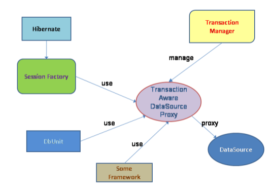
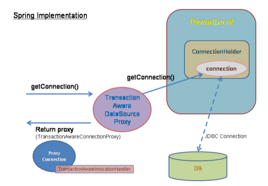
```xml
<bean id="transactionManager" class="org.springframework.jdbc.datasource.DataSourceTransactionManager">
		<property name="dataSource" ref="dataSource"/>
</bean>
<!--위의 transactionManager는 default 값이므로 명시적으로 써주지 않아도된다-->
<tx:annotation-driven transaction-manager="transactionManager"/>
```


```java
@Transactional
@Override
public void execute(String partName, String productName, int productPrice) throws Exception {
    PartVO part = new PartVO();
    part.setPartName(partName);

    partDAO.insert(part);

    ProductVO product = new ProductVO();
    product.setProductName(productName);
    product.setProductPrice(productPrice);
    product.setPartId(part.getPartId());

    productDAO.insert(product);

    System.out.println(part);
    System.out.println(product);
}
```
Code 내 `transaction` mark<br/>
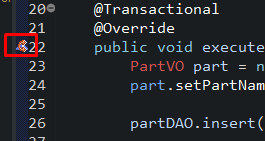
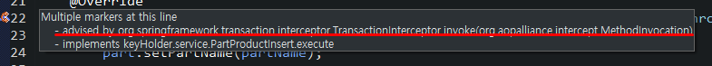


```java
PartProductInsert service3 = ctx.getBean(PartProductInsert.class);
service3.execute("의류", "게이밍마우스", 50000);
```
`part`에 `의류`라는 `partName`을 통해 새로운 `part` 생성과 동시에 `product`도 생성
```java
@Transactional
@Override
public void execute(String partName, String productName, int productPrice) throws Exception {
    PartVO part = new PartVO();
    part.setPartName(partName);

    partDAO.insert(part);

    ProductVO product = new ProductVO();
    product.setProductName(productName);
    product.setProductPrice(productPrice);
    product.setPartId(3000);
    //존재할 수 없는 partId를 집어넣었다.

    productDAO.insert(product);

    System.out.println(part);
    System.out.println(product);
}
```
기존 `TransactionManager`가 없을때는` product` 입력오류가 나도
`part`는 입력이 되었지만

아래 DB결과를 보는것과 같이 `의류`가 등록되지않았다.
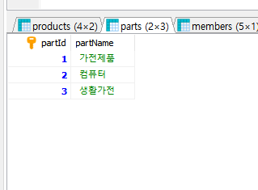

또한 `TransactionManager`를 사용하면 `org.springframework.transaction` 패키지에 제공되는 `Exception`으로 변환되어 전가된다.

---
# Spring MVC
Web Project를 개발하기 위한 Library
Spring Legacy Project를 이용하여 프로젝트 생성.

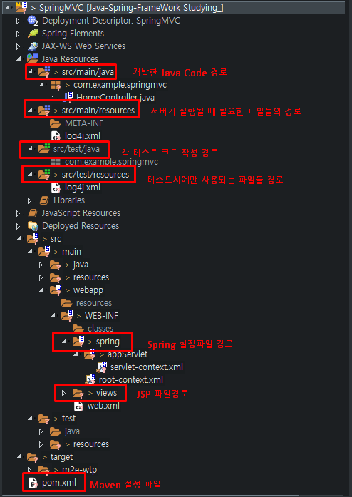
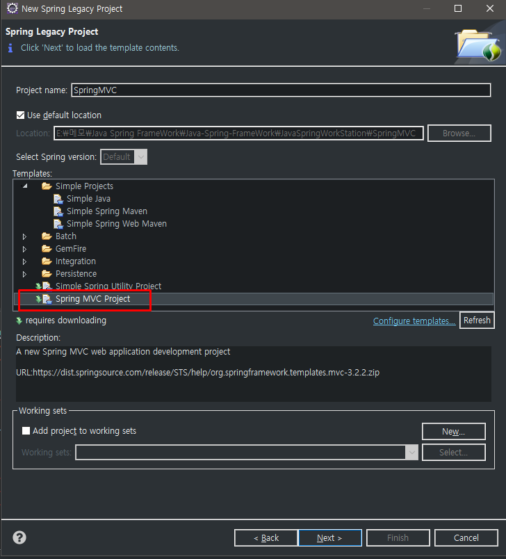
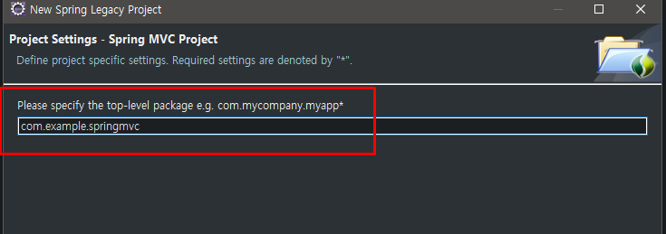

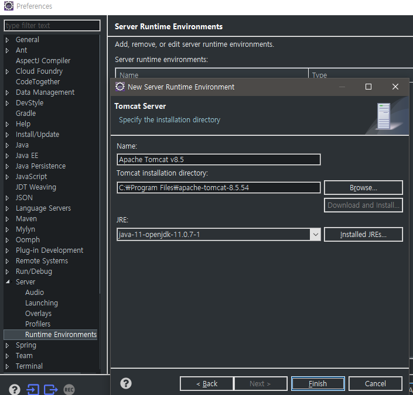
java - java, junit
resources - xml

/resources/abc.jpg
resource 작동
```xml
<?xml version="1.0" encoding="UTF-8"?>
<beans:beans xmlns="http://www.springframework.org/schema/mvc"
	xmlns:xsi="http://www.w3.org/2001/XMLSchema-instance"
	xmlns:beans="http://www.springframework.org/schema/beans"
	xmlns:context="http://www.springframework.org/schema/context"
	xsi:schemaLocation="http://www.springframework.org/schema/mvc https://www.springframework.org/schema/mvc/spring-mvc.xsd
		http://www.springframework.org/schema/beans https://www.springframework.org/schema/beans/spring-beans.xsd
		http://www.springframework.org/schema/context https://www.springframework.org/schema/context/spring-context.xsd">

	<!-- DispatcherServlet Context: defines this servlet's request-processing infrastructure -->

	<!-- Enables the Spring MVC @Controller programming model -->
	<annotation-driven />

	<!-- Handles HTTP GET requests for /resources/** by efficiently serving up static resources in the ${webappRoot}/resources directory -->
	<!-- 이미지 사용 시 resources 하위로 들어가는데
	해당 디렉토리를 이용할 시
	resources mapping으로 폼이 바귄다.-->
	<resources mapping="/resources/**" location="/resources/" />

	<!-- Resolves views selected for rendering by @Controllers to .jsp resources in the /WEB-INF/views directory -->
	<beans:bean class="org.springframework.web.servlet.view.InternalResourceViewResolver">
		<beans:property name="prefix" value="/WEB-INF/views/" />
		<beans:property name="suffix" value=".jsp" />
	</beans:bean>

	<context:component-scan base-package="com.example.springmvc" />

</beans:beans>
```


`Java Resources`의 src와 src는 같은 디렉토리이다.

하지만 `Java Resources`같은 경우 세부 설정파일이
위의 `Spring Elements`와 `JAX-WS Web Services` 와 같은 디렉토리에 나누어 들어가져있다.

즉 위 파일들은 `Maven`이 설정대로 정리해준 디렉토리
아래 src부터는 `local`에 존재하는 파일디렉토리들을 그대로 올려준것이다.
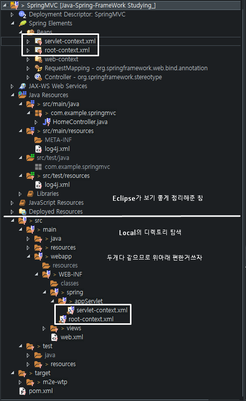
