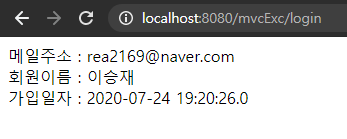
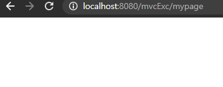

# form Tag
`jquery` download
```jsp
<%@ page language="java" contentType="text/html; charset=UTF-8"
    pageEncoding="UTF-8"%>
<%@ taglib uri="http://www.springframework.org/tags/form" prefix="form" %>
<!DOCTYPE html>
<html>
<head>
<meta charset="UTF-8">
<title>Insert title here</title>
<script src="js/jquery-3.5.1.min.js"></script>
</head>
<body>
<form:form>
</form:form>

</body>
</html>
```


`Command` 객체 생성
```java
public class MemberCommand {
	private String name;
	private int age;
```

`Controller` 를 통해 `Command` 객체 `model`에 저장
```java
@Controller
public class VaildatorController {

	@RequestMapping(value="/vaildator", method=RequestMethod.GET)
	public String vaildater(Model model) {
		model.addAttribute("info", new MemberCommand());
		return "form";
	}
}
```

`Mapping`된 `jsp`에서 해당 `model`의 값 꺼내 쓴다
```jsp
<form:form modelAttribute="info">
	<label for="name" >
		이름 : <form:input type="text" path="name"/>
		<!-- info라는 model -> MemberCommand NameGetter를 가져오라는 의미 -->
	</label>
	<label for="age" >
		연령 : <form:input type="text" path="age"/>
		<!-- info라는 model -> MemberCommand AgeGetter를 가져오라는 의미 -->
	</label>
</form:form>
```
---
# Validator

Command 객체를 검증하고 jsp페이지에서 에러코드로 부터 메세지를 출력하는 기능 제공
```java
public class MemberValidator implements Validator {

	@Override
	public boolean supports(Class<?> clazz) {
		//return MemberCommand.class.isAssignableFrom(clazz);
		//Class를 이용한 비교.
		
		return clazz.isAssignableFrom(MemberCommand.class);
		
	}

	@Override
	public void validate(Object target, Errors errors) {
		// Validator가 검증 할 수 있는 타입인가를 검사하는데 사용
		// target = memberCommand
		// validate로 넘어 오는 targetd에 대한 type체크를 supprots에서 하게된다.
		
		//supports에서 type비교가 끝난 후 validate로 넘어온다
		MemberCommand cmd = (MemberCommand)target;
		if(cmd.getName() == null || cmd.getName().trim().equals("")) {
			errors.rejectValue("name", "name.required", "회원이름이 입력되지 않았습니다.");
			//arg1 = fielName
			//errorCode = Message 
			//defaultMessage = errorCode가 없다면 지정될 Message
		}
		//ValidationUtils.rejectIfEmptyOrWhitespace(errors, field, errorCode);
		if(cmd.getAge() == 0) {
			errors.rejectValue("age", "age.required", "연령이 입력되지 않았습니다.");
		}
	}
}
```

앞단에서 쓰이는 모습
```java
@RequestMapping(value="/vaildator", method=RequestMethod.POST)
public String postVaildater(@ModelAttribute("info") MemberCommand cmd, Errors errors) {
    new MemberValidator().validate(cmd, errors);
    if(errors.hasErrors()) {
        return "form";
    }
    else {
        return "result";
    }
}
```

```jsp
<form:form modelAttribute="info">
	<label for="name" >
		이름 : <form:input type="text" path="name"/>
		<!-- info라는 model -> MemberCommand NameGetter를 가져오라는 의미 -->
		<form:errors path="name"/>
	</label>
	<label for="age" >
		연령 : <form:input type="text" path="age"/>
		<!-- info라는 model -> MemberCommand AgeGetter를 가져오라는 의미 -->
		<form:errors path="age"/>
	</label>
	<button>등록하기</button>
</form:form>
```

---
# 메세지 처리
`View`에 문자열이 하드코딩 되어있는 경우 부분 수정을 위해서는 해당 `.jsp`를 찾고 고쳐야한다.

이러한 문제를 해결하기 위해 파일을 불러와서 출력하자.

- 메시지 파일 작성
- 메세지 파일에서 값을 읽어오는 `MessageSource Bean` 작성
- jsp 페이지에서 `<spring:message>` 태그를 이용하여 해당 문자열 출력

`Build Path` 위에 있는 `Folder`들은 `package`로 인식하므로 


---
`src/main/resources/message/register.properties`
```
title=회원가입
label.email=메일주소
label.pass=비밀번호
label.passCheck=비밀번호확인
label.nick=회원이름
label.send=등록하기
```

`servlet-context.xml`
```xml
<beans:bean id="messageSource" class="org.springframework.context.support.ResourceBundleMessageSource">
    <beans:property name="basenames">
    <beans:list>
        <beans:value>message.register</beans:value>
        <!-- message/register -->
    </beans:list>
    </beans:property>
    <beans:property name="defaultEncoding" value="UTF-8"/>
</beans:bean>
```
`resource`폴더 하위 `register`이라는 이름의 `.properties` 파일을 참조할 것임을 의미

`resource`폴더는 classpath에 포함된 폴더 임으로 
해당 폴더를 `javaSystem`에서 `package`로 인식하여 `message.register`와 같은 `package` 참조 방식을 이용한다.

현재는 servlet-context.xml에 바로 작성하였지만
`<beans:import resource="classpath:Message.xml">` 과 같은 방식으로
다른 xml파일을 import할수 있다. 그전에 component-scan이 선언되어야한다.


```jsp
<%@ page language="java" %>
<%@ page contentType="text/html; charset=utf-8" %>
<%@ page pageEncoding="utf-8" %>
<%@ taglib uri="http://java.sun.com/jsp/jstl/core" prefix="c" %>
<%@ taglib uri="http://www.springframework.org/tags" prefix="spring" %>
<%@ page session="false" %>
<!DOCTYPE html>
<html>
<head>
	<title>Home</title>
	<meta charset="utf-8"/>
</head>
<body>
<h1>
	Hello world!  
</h1>

<P>  The time on the server is ${serverTime}. </P>

<spring:message code="title"/><hr>
<spring:message code="label.email"/> : <input type="text"/>
<button><spring:message code="label.send"/></button>
</body>
</html>
```

`validator` `error code`에 `message` 넣기

```java
if(cmd.getName() == null || cmd.getName().trim().equals("")) {
        errors.rejectValue("name", "name.required", "회원이름이 입력되지 않았습니다.");
    }
    if(cmd.getAge() == 0) {
        errors.rejectValue("age", "age.required", "연령이 입력되지 않았습니다.");
    }
```
`errors.properties`
```xml
name.required=회원이름은 필수입력 항목입니다.
age.required=회원나이는 필수입력 항목입니다.
```
`Message.xml`
```xml
<?xml version="1.0" encoding="UTF-8"?>
<beans xmlns="http://www.springframework.org/schema/beans"
	xmlns:xsi="http://www.w3.org/2001/XMLSchema-instance"
	xsi:schemaLocation="http://www.springframework.org/schema/beans http://www.springframework.org/schema/beans/spring-beans.xsd">

	<bean id="messageSource" class="org.springframework.context.support.ResourceBundleMessageSource">
		<property name="basenames">
			<list>
				<value>message.errors</value>
			</list>
		</property>	
		<property name="defaultEncoding" value="UTF-8"/>
	</bean>
</beans>

```
외부 `Message.xml`을 `import`
`servlet-context.xml`
```xml
<beans:import resource="classpath:message/Message.xml"/>
```
---
# Controller에서 HttpSession 사용

```java
@Override
public void execute(HttpSession session, String email, String pass) throws MemberException {
    MemberVO member = dao.login(email, pass);
    if(member == null ) {
        throw new MemberNotFoundException();
    }
    session.setAttribute("loginInfo", member);
}
```
`HttpSession`에 `memberVO` 정보 저장

```java
@RequestMapping(value="/login", method=RequestMethod.POST) 
public String login(@RequestParam("email") String email,
        @RequestParam("pass") String pass,
        HttpServletRequest request,
        HttpSession session) {
    try {
        service.execute(session, email, pass);
        return "mypage";
    }
    catch(MemberException e) {
        e.printStackTrace();
        return "loginError";
    }
}
```
`login`으로 부터 `parameter`정보를 받아와서 `loginService`의
메서드에 넣어주고 알맞는 값 반환 시 `login` 처리


```jsp
<%@ page language="java" contentType="text/html; charset=UTF-8"
    pageEncoding="UTF-8"%>
<%@ taglib uri="http://java.sun.com/jsp/jstl/core" prefix="c" %>
<!DOCTYPE html>
<html>
<head>
<meta charset="UTF-8">
<title>Insert title here</title>
</head>
<body>
<!-- Session의 정보를 받아와서 찍어주는 모습. -->
<c:if test="${!empty loginInfo}">
	메일주소 : ${loginInfo.email}<br/>
	회원이름 : ${loginInfo.nick}<br/>
	가입일자 : ${loginInfo.registeredAt}<br/>
</c:if>
</body>
</html>
```


---
## CodeTester
`@Test` 는 JUnit 4.12 버전 이상부터 사용가능.

해당 클래스의 package 이름과 같은 package 위에 만들어져야한다.
```java
@RunWith(SpringJUnit4ClassRunner.class)
//root-context 와 servlet-context 위치 읽어오기
@ContextConfiguration(locations= {
		"file:src\\main\\webapp\\WEB-INF\\spring\\root-context.xml",
		"file:src\\main\\webapp\\WEB-INF\\spring\\appServlet\\servlet-context.xml"
})
public class loginTester {
    @Autowired
    //일어오 context를 기반으로 applicationcontext생성
	ApplicationContext context;
	
	@Test @Ignore
	public void loginTest() {
        //bean에서 꺼내와서 실험.
		Login service = context.getBean("login", Login.class);
		try {
			service.execute("sky_battle@naver.com", "1234");
			System.out.println("로그인성공");
		}
		catch(MemberException e) {
			System.out.println("로그인실패");
		}
	}
}
```
`JUnit` 실행 화면 <br/>


---
# Spring Interceptor
요청에 따른 비지니스 로직 수행 전이나 수행 이후 작업을 추가하고자 할 때 사용

- Controller 실행 전
- Controller 실행 후
- View를 실행한 후


`HandlerInerceptor`를 상속받는 `Interceptor` 생성
```java
public class SessionCheckInterception implements HandlerInterceptor {
	
	@Override
	public boolean preHandle(HttpServletRequest request, HttpServletResponse response, Object handle) {
		HttpSession session = request.getSession(false);
		//이전에 session이 존재했다면 session 반환
		//session이 존재하지 않다면 false를 반환
		
		if(session == null ) {
			//session이 비어있다면 return
			return false;
		}
		if(session.getAttribute("loginInfo") == null ) {
			//로그인한 정보가 존재하지 않다면 return
			return false;
		}
		
		return true;
	}
}
```


`Bean`에 `Interceptor` 등록
`servlet-context.xml`
```xml
<interceptors>
    <interceptor>
        <mapping path="/mypage"/>
        <beans:bean class="com.mycompany.interceptor.SessionCheckInterception"/>
    </interceptor>
</interceptors>
```
`session` 정보 없이 바로 `mypage` 접근 시 아무런 페이지가 뜨지 않는다.<br/>
<br/>
`Interceptor`의 `preHandle`이 `false`를 반환하여 아무런 행동도 취하지 않았기 때문

즉 `view`에서 `controller`에 도달하기 전에 `interceptor`에 들려 `handler`에 따라 행동을 취한다.


