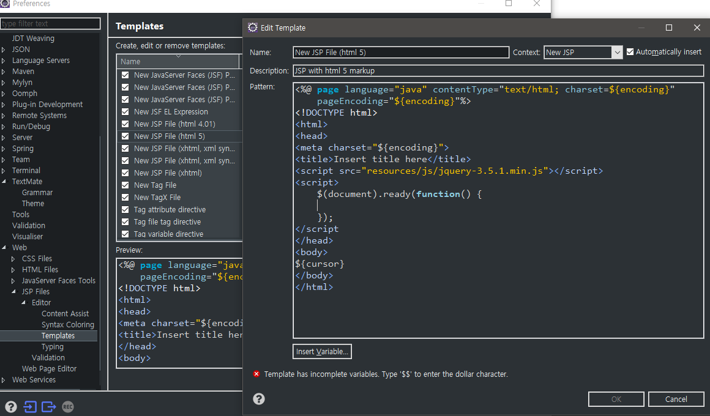

# mybatis
>참고 : https://mybatis.org/mybatis-3/ko/index.html

SQL, 저장프로시저, 몇 가지 고급 매핑을 지원하는 Persistance framework.
SqlSessionFactory는 SqlSession 객체를 새엉하기 위한 클래스로 SQlsSessionFactoryben에 의해 생성

DB 접속에 필요한 DataSource와 MyBatisConfig파일 Mapping File을 참조함.

```xml
<dependency>
        <groupId>org.mybatis</groupId>
        <artifactId>mybatis-spring</artifactId>
        <version>2.0.5</version>
    </dependency>
    <!-- https://mvnrepository.com/artifact/org.mybatis/mybatis -->
    <dependency>
        <groupId>org.mybatis</groupId>
        <artifactId>mybatis</artifactId>
        <version>3.5.5</version>
    </dependency>
```
`js`와 `document` 기본설정




## Mapper
SqlSessionFactory가 사용할 Mapper 생성
일반 xml 생성

```xml
<!DOCTYPE mapper PUBLIC "-//mybatis.org//DTD Mapper 3.0//EN"
"http://mybatis.org/dtd/mybatis-3-mapper.dtd">

<mapper namespace="com.mycompany.mybatis">
	<select id="select" parameterType="java.lang.String">
    <!-- String을 직접 넣을 때-->
		SELECT * FROM members WHERE email = #{email}
	</select>

    <select id="select" parameterType="com.mycompany.mybatis.vo.MemberVO">
    <!-- Member를 집어넣을떄-->
    <!-- 너무 길다 바꾸자.-->
```

## TypeAliases
```xml
<!-- Mapper에 쓸 type들 지정-->
<?xml version="1.0" encoding="UTF-8"?>
<!DOCTYPE config PUBLIC "-//mybatis.org//DTD Configuration 3.0//EN"
"http://mybatis.org/dtd/mybatis-3-config.dtd">
<!-- Config로 바꿔주어야한다.-->
```

`Mapper`에서 쓸 Member에 대해서 alias할 configXML 생성
```xml
<?xml version="1.0" encoding="UTF-8"?>
<!DOCTYPE configuration PUBLIC "-//mybatis.org//DTD Config 3.0//EN"
"http://mybatis.org/dtd/mybatis-3-config.dtd">

<configuration>
	<typeAliases>
		<typeAlias alias="Member"
			type="com.mycompany.mybatis.vo.MemberVO" />
	</typeAliases>
</configuration>
```

Mapper의 최종 모습

```xml
<!DOCTYPE mapper PUBLIC "-//mybatis.org//DTD Mapper 3.0//EN"
"http://mybatis.org/dtd/mybatis-3-mapper.dtd">

<mapper namespace="com.mycompany.mybatis">
	<mapper namespace="myNS">
    <!-- resultType에 대해서 alias한 type으로 써준다.-->
	<select id="select" parameterType="java.lang.String" resultType="Member">
		SELECT * FROM members WHERE email = #{email}
	</select>
```
사용시 `myNS.select.Member` 와 같은 방식으로 값을 가져온다.
`insert` `delete` `update` 는 `resultType`을 명시할수 없다.
```xml
<insert id="insert" parameterType="Member">
    INSERT INTO members VALUES(#{email}, #{pass}, #{nick}, default, default)
</insert>
```
```xml
<update id="update" parameterType="Member">
    UPDATE members SET pass=PASSWORD(#{pass}), nick=#{nick} WHERE email=#{email}
</update>
```
```xml
<update id="delete" parameterType="java.lang.String">
    UPDATE members SET removeAt=CURRENT_TIMESTAMP WHERE email=#{email}
</update>
```


`SqlSessionFactoryBean`을 `root-context.xml`에 생성.
```xml
<bean id="sqlSessionFactory" class="org.mybatis.spring.SqlSessionFactoryBean">
    <property name="dateSource" ref="dataSource"/>
    <property name="configLocation" value="classpath:MybatisConfig.xml"/>
    <property name="mappterLocations">
        <list>
            <value>classpath:Mapper.xml</value>
        </list>
    </property>
</bean>
```

`SqlSessionFactoryBean`을 사용하는 `sqlSession` 등록
```xml
<bean id="sqlSession" class="org.mybatis.spring.SqlSessionTemplate">
    <constructor-arg ref="sqlSessionFactory"/>
</bean>
```


```java
@Repository("memberDAO")
public class MemberDAOImpl implements MemberDAO {

	@Autowired
	private JdbcTemplate jTemp;	
    
    //dao에서 자동 주입받은 SqlSession
	@Autowired
    private SqlSession session;
    
    ...
```
```java
session.selectList // 한컬럼을 가져옴
session.selectMap // 해당 테이블을 가져온다.
```
`MemberDAOImpl`
```java
@Override
public MemberVO selectByEmail(String email) throws Exception {
    return session.selectOne("myNS.selectByEmail", email);
}
```
`String`으로 받은 `email`이 `Mapper`의 `sql`문의 `java.lang.String type`으로 들어가게된다.
`Mapper`
```xml
<mapper namespace="myNS">
	<select id="selectByEmail" parameterType="java.lang.String" resultType="Member">
		SELECT * FROM members WHERE email = #{email}
	</select>
```
---
### Mapper Interface
CompileTime에 해당의 Mapper가 올바른지 알 수 없고 `Runtime`에만 알 수 있다.
Mapper Interface 사용 시 `CodeAssistance`를 통해 안전하게 사용가능

```java
public interface MemberMapper {
    MemberVO insert(MemberVO member) throws Exception;
    //넣어주는 메서드와 인수는 mapper의 것을 그대로 넣어준다
}
```

`mapper id`는 메서드명이 되고 `parameterType`은 인자가 된다. `resultType`은 반환값
```xml
<insert id="insert" parameterType="Member">
    INSERT INTO members VALUES(#{email}, #{pass}, #{nick}, default, default)
```

`Mapper.xml`의 `Namespace`에 `MemberMapper interface`의 위치를 넣어준다.
```xml
<mapper namespace="com.mycompany.mybatis.mapper.MemberMapper">
```

`Mapper interface` 와 `Mapper.xml`을 연결할 때 주의사항

- `interface`내의 메서드명과 <Mapper>내의 요소 id는 일치해야한다
- `interface`의 인수 타입과 `parameterType`은 일치해야한다
- `interface` 반환값과 `resultType`은 일치해야한다


최종적으로 `Mapper interface`를 `Bean`에 올려준다.

`root-context.xml`
```xml
<bean id="memberMapper" class="org.mybatis.spring.mapper.MapperFactoryBean">
    <property name="mapperInterface" value="com.mycompany.mybatis.mapper.MemberMapper"/>
    <property name="sqlSessionTemplate" ref="sqlSession"/>
</bean>
```

`jdbcTemplate` -> `sqlSession` -> `MemberMapper interface`
```java
@Repository("memberDAO")
public class MemberDAOImpl implements MemberDAO {
	
	@Autowired
    private MemberMapper mapper;
    
    @Override
	public void insert(MemberVO member) throws Exception {
		mapper.insert(member);
		//Mapper Interface 사용 시 에 CodeAssistance를 통해 안전하게 사용가능
	}
```
---
### MapperScannerConfigurer

```xml
<mybatis-spring:scan base-package="kr.co.lectopia.mapper"/>
```
`MapperInterface`에 대해서 하나하나 지정해줄 필요 없다.
하나의 `package`에 대해서 `mybatis base-package`로 지정해준 모습.

---
#### FileUpload Tomcat
`pom.xml`
```xml
<!-- commons-fileupload -->
<dependency>
    <groupId>commons-fileupload</groupId>
    <artifactId>commons-fileupload</artifactId>
    <version>1.4</version>
</dependency>
```
`classpath/resources`에 `FileUpload`라는 이름으로
`Spring Bean Configuration` 등록
```xml
<bean id="multipartResolver"
    class="org.springframework.web.multipart.commons.CommonsMultipartResolver">
    <property name="maxUploadSize" value="10485760"/>	
</bean>
```
maxSize에 대한 value는 연산을 통한 값이 와야한다.
5GB = 5 * 1024 * 1024 (Byte단위);

실제파일 저장 `localpath` 지정
```xml
<bean id="uploadPath" class="java.lang.String">
    <constructor-arg value="C:/Temp"/>
</bean>
```

`servlet-context.xml`
```xml
<beans:import resource="classpath:FileUpload.xml"/>
```

```jsp
<%@ page language="java" contentType="text/html; charset=UTF-8"
    pageEncoding="UTF-8"%>
<!DOCTYPE html>
<html>
<head>
<meta charset="UTF-8">
<title>Insert title here</title>
<script src="resources/jquery-3.5.1.min.js"></script>
<script>
	$(document).ready(function() {
		$('#btnUpload').click(function() {
			var form = document.getElementById("uploadForm");
			//uploadForm 내부의 input file의 값을 받아온다
			var formData = new FormData(form);
			//fileField를 갖는 formData
			$.ajax({
				url : 'upload',
				type : 'POST',
				data : formData,
				//-----아래 두개 반드시 지정할 것 -------
				processData: false,
				contentType: false,
				//----미지정 시 프로그램이 알아서 지정해버림 -
				dataType: 'text',
				success : function(data) {
					console.log(data);
				}
			});
			alert("파일을업로드합니다.");
		});
	});
</script>
</head>
<body>

<form id="uploadForm" method="POST" enctype="multipart/form-data">
업로드 파일 <input type="file" id="upfile" name="upfile"/><br/>
<button id="btnUpload">업로드</button>
</form>

</body>
</html>
```
```java
@Controller
public class UploadController {
	@Autowired
	@Qualifier("uploadPath")
	private String uploadPath;
	
	@RequestMapping(value="/upload", method=RequestMethod.GET)
	public String upload() {
		return "form";
	}
	
	@RequestMapping(value="/upload", method=RequestMethod.POST)
	public void upload(@RequestParam("upfile")MultipartFile file, HttpServletResponse response) throws IOException{
		System.out.println("파일 업로드명 : "+file.getOriginalFilename());
		System.out.println("업로드 파일유형 : "+file.getContentType());
		System.out.println("업로드 파일크기 : "+file.getSize());
		response.setContentType("text/plain; charset=utf-8");
		PrintWriter out = response.getWriter();
		File saveFile = new File(uploadPath, file.getOriginalFilename());
		FileCopyUtils.copy(file.getBytes(),saveFile);
		//파일데이터 생성
		out.print(file.getOriginalFilename());
	}
}
```
```jsp
업로드 파일 <input type="file" id="upfile" name="upfile" multiple/><br/>
<!-- 여러개 파일 업로드하기 -->
```

```java
@RequestMapping(value="/upload", method=RequestMethod.POST)
public void upload(@RequestParam("upfile")MultipartFile[] files, HttpServletResponse response) throws IOException{
    response.setContentType("text/plain; charset=utf-8");
    for(MultipartFile file : files) {
        PrintWriter out = response.getWriter();
        out.print(file.getOriginalFilename());
        out.print(file.getSize());
        out.print(file.getContentType());
        File saveFile = new File(uploadPath, file.getOriginalFilename());
        FileCopyUtils.copy(file.getBytes(),saveFile);
    }
}
```
`MultiPartFormData`에서 하나씩 꺼내올 수 있다.