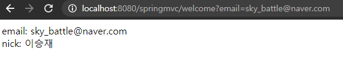

# Spring MVC 
## web.xml
src/main/webapp/WEB-INF/web.xml 파일은 Deployment Descriptor이다.
```xml
<?xml version="1.0" encoding="UTF-8"?>
<web-app version="2.5" xmlns="http://java.sun.com/xml/ns/javaee"
	xmlns:xsi="http://www.w3.org/2001/XMLSchema-instance"
	xsi:schemaLocation="http://java.sun.com/xml/ns/javaee https://java.sun.com/xml/ns/javaee/web-app_2_5.xsd">

	<!-- The definition of the Root Spring Container shared by all Servlets and Filters -->

    <!-- ApplicationContext 객체 생성시 Spring Bean Configuration 파일의 위치정보를 전달하기 위한 
    파라미터 설정 부분 -->
	<context-param>
		<param-name>contextConfigLocation</param-name>
        <!-- 웹구동시 root-context.xml 파일이 사용되고있다.-->
		<param-value>/WEB-INF/spring/root-context.xml</param-value>
	</context-param>
	
	<!-- Creates the Spring Container shared by all Servlets and Filters -->
    <!-- ApplicationContext가 구동 될때 수행할 Linstener를 설정하는 부분. Web Application이 구동 될 때 리스너를 자동으로 실행. -->
	<listener>
		<listener-class>org.springframework.web.context.ContextLoaderListener</listener-class>
	</listener>

	<!-- Processes application requests -->

    <!-- 클라이언트 요청에 대한 응답처리 클래스 지정 servlet mapping-->
    <!-- Spring MVC는 모든 요청에 대한 응답처리를 DispatcherServlet 클래스가 하고있다. -->
	<servlet>
		<servlet-name>appServlet</servlet-name>
		<servlet-class>org.springframework.web.servlet.DispatcherServlet</servlet-class>
		<init-param>
			<param-name>contextConfigLocation</param-name>
			<param-value>/WEB-INF/spring/appServlet/servlet-context.xml</param-value>
		</init-param>
		<load-on-startup>1</load-on-startup>
	</servlet>
		
	<servlet-mapping>
		<servlet-name>appServlet</servlet-name>
		<url-pattern>/</url-pattern>
	</servlet-mapping>

</web-app>
```
---
## root-context.xml
`ApplicationContext` 객체가 초기화 될때 사용
`Spring Bean Configuration` 파일이다.
`root-context`에는 `view`와 관련되지 않는 빈 객체를 정의한다.
즉 `Service`나 `DAO`, `DataSource`등을 말한다.

---
## servlet-context.xml
`Servlet`이 초기화 될 때 전달되는 `Spring Bean Configuration` 파일
`Controller`나 `Annotation`, `ViewResolver`, `Interceptor`,
`MultipartResolver`등 `DispatcherServlet`과 관련된 설정을 한다
```xml
<?xml version="1.0" encoding="UTF-8"?>
<beans:beans xmlns="http://www.springframework.org/schema/mvc"
	xmlns:xsi="http://www.w3.org/2001/XMLSchema-instance"
	xmlns:beans="http://www.springframework.org/schema/beans"
	xmlns:context="http://www.springframework.org/schema/context"
	xsi:schemaLocation="http://www.springframework.org/schema/mvc https://www.springframework.org/schema/mvc/spring-mvc.xsd
		http://www.springframework.org/schema/beans https://www.springframework.org/schema/beans/spring-beans.xsd
		http://www.springframework.org/schema/context https://www.springframework.org/schema/context/spring-context.xsd">

	<!-- DispatcherServlet Context: defines this servlet's request-processing infrastructure -->
	
	<!-- Enables the Spring MVC @Controller programming model -->
    <!-- annotation 활성화 -->
	<annotation-driven />

	<!-- Handles HTTP GET requests for /resources/** by efficiently serving up static resources in the ${webappRoot}/resources directory -->
    <!-- RequestURI가 mapping 속성에서 지정한 패턴에 해달 할 경우 web.xml 파일의 servlet-mapping에서 지정된 
    DispatcherServlet에 의한 처리가 무효화된다. 또한 웹 경로 /resources를 webapp/resources 폴더로 연결-->
	<resources mapping="/resources/**" location="/resources/" />

	<!-- Resolves views selected for rendering by @Controllers to .jsp resources in the /WEB-INF/views directory -->
    <!-- InternalResourceViewResolver타입의 ViewResolver 객체를 생성하고 등록한다. -->
	<beans:bean class="org.springframework.web.servlet.view.InternalResourceViewResolver">
    <!-- ViewResolver는 spring MVC 프레임워크에서 사용되며 컨트롤러가 반환하는 값과 ViewResolver를 이용하여
    클라이언트에 보여줄 View를 선택한다. -->
		<beans:property name="prefix" value="/WEB-INF/views/" />
		<beans:property name="suffix" value=".jsp" />
	</beans:bean>
	
	<context:component-scan base-package="com.example.springmvc" />
</beans:beans>
```
---
## HomeController
```java
/**
 * Handles requests for the application home page.
 */
@Controller
public class HomeController {
	
	private static final Logger logger = LoggerFactory.getLogger(HomeController.class);
	
	/**
	 * Simply selects the home view to render by returning its name.
	 */
    //URI를 GET 방식으로 요청시 수행될 메서드
    //반환값은 home
    @RequestMapping(value = "/", method = RequestMethod.GET)
	public String home(Locale locale, Model model) {
		return "home";
    }
    //메서드의 결과로 home을 반환하게되면 SpringFrameWork는 이 반환 값에 suffix 속성값은 ".jsp"
    //를 붙이고 그 결과인 "home.jsp"라는 파일의 prefix 속성값인 /WEB-INF/views/ 를 붙여
    // "/WEB-INF/views/home.jsp" 파일을 View로 선택하게된다.
}
```
최종적으로 URI가 요청하면 String을 반환하여 jsp파일을 return한다.

---
## Spring MVC 동작 원리


1. 클라이언트가 서버에게 요청을 보낸다. 서버에게 오는 모든 요청은 `DispatcherServlet`이 받는다.

2. `DispatcherServlet`은 요청된 URL을 `HandlerMapping` 객체에 넘기고, 호출해야 할 `Controller` 메소드(`Handler`) 정보를 얻는다.

3. `Controller` 를 반환받은 `DispatcherServlet`은 `HandlerAdapter`에게 컨트롤러 수행을 요청한다.
```
보다 정확하게 표현한다면, HandlerMapping은 DispatcherServlet로부터 전달된 URL을 바탕으로

HandlerAdapter 객체를 포함하는 HandlerExecutionChain 객체를 생성하며,

이후 DispatcherServlet이 HandlerExecutionChain 객체로부터 

HandlerAdapter 객체를 가져와서 해당 메소드를 실행하게 된다.
```

`Controller`가 요청을 처리하고 반환함에 있어 `ModelAndView`를 사용하기 때문에 `HandlerAdapter`가 클라이언트 요청정보를 `Controller`가 필요로하는 형식의 데이터나객체로 변환하여 제공한다. 

최종적으로 `Controller`의 처리 결과를 `ModelAndView` 객체로 변환하는 역할을 한다.

4. `HandlerAdapter`가 `ModelAndView`를 `Controller`에 보낸다.

5. `Controller` 객체는 비즈니스 로직을 처리하고, 그 결과를 바탕으로 뷰(ex. JSP)에 전달할 객체를 `Model` 객체에 저장한다. `DispatcherServlet`에게 `view` name을 리턴한다.

6. `DispatcherServlet`은 `view` name을 `View Resolver`에게 전달하여 View 객체를 얻는다.

7. `DispatcherServlet`은 View 객체에 화면 표시를 의뢰한다.

8. `View` 객체는 해당하는 뷰(ex. JSP, Thymeleaf)를 호출하며, 뷰는 Model 객체에서 화면 표시에 필요한 객체를 가져와 화면 표시를 처리한다.


---
## Controller
`DispatcherServlet`은 요청을 처리할 컨트롤러를 `HandlerMapping`을 사용하여 검색하며
이떄 `HandlerMapping`은 요청에 대한 `Controller`를 검색하기 위해 `@Controller` annotation을 사용한다.
```java
@Controller
public class WelcomeController {

	@RequestMapping("/welcome")
	public String welcome() {
		return "welcome";
	}
}
```
`@Controller annotation`이 부여된 클래스는 여러 메서드를 포함할 수 있으며 이 메서드 중
`@RequestMapping annotation`이 지정된 메서드를 이용하여 요청에 대한 처리를 수행할 메서드 선택

요청처리를 위한 메서드를 `Handler`라고 한다.

`Controller`는 요청정보 `RequestURI`와 `@RequestMappin`g`을 통해 요청과 핸들러를 쌍으로 하는 맵핑정보를 활용한다.


`RequestMapping`에 맞게 `jsp` 생성

`root디렉터리/welcome` 으로 나오는모습


---
## Handler
클라이언트 요청에 대한 처리를 담당하는 메서드

1. `@RequestMapping` annotation 선언
2. `Handler`메서드는 `public` 접근제한자이어야 한다.

```java
@Controller
public class WelcomeController {
	@RequestMapping("/welcome")
	public void welcome(HttpServletRequest request, HttpServletResponse reponse) throws IOException {
		reponse.setContentType("text/html; charset=utf-8");
		PrintWriter out = reponse.getWriter();
		out.println("Welcome");
	}
}
```
요청처리 `Handler`가 아무것도 반환하지 않는다.
`DispatcherServlet`은 `null`을 반환하는 해당 `Handler`를 호출하지 않는다.

```java
@RequestMapping("/welcome")
public void welcome(HttpServletRequest request, HttpServletResponse reponse) throws IOException {
    reponse.setContentType("text/html; charset=utf-8");
    String email = request.getParameter("email");
    
    PrintWriter out = reponse.getWriter();
    out.println("Welcome : " + email);
}   
```


또한 매개변수의 순서도 상관없다.
```java
@RequestMapping("/welcome")
public void welcome(HttpServletRequest request, HttpServletResponse reponse) throws IOException {
    reponse.setContentType("text/html; charset=utf-8");

    PrintWriter out = reponse.getWriter();
    out.println("Welcome : " + email);

    String email = request.getParameter("email");
}   
```
문제없이 출력된다.

---
### Handler Return
|ReturnValue|Description|
|:-:|:-:|
|String |뷰 이름 반환|
|ModelAndView|뷰에 전달할 ModelAndView 객체를 반환|
|View|응답처리를 담당하는 View객체에 직접반환 이경우 DispatcherServlet은 <br/>ViewReslover를 이용하지 않고 직접 View를 이용하여 응답, 주로 Ajax처리시 사용|


#### return model
```java
@RequestMapping("/welcome")
public String welcome(HttpServletRequest request, Model model) {
    String email = request.getParameter("email");
    //model.addAttribute(email);//그냥 등록하면 타입이름으로 등록한다.
    model.addAttribute("email", email);
    return "welcome";
}
```
`request`를 통해 요청객체로부터 추출한 `Model` 객체를 입력받는다.
`Model`에 추가된 속성은 자동으로 `View`의 `HttpServletRequest` 객체의 속성으로 저장된다.
또한 `Model`은 `View` 기능이 없으므로 `ViewResolver`에 의해 `View`를 선택할 수 있게 `View` 이름반환


```js
<%@ page language="java" contentType="text/html; charset=UTF-8" pageEncoding="UTF-8"%>
<!DOCTYPE html>
<html>
<head>
<meta charset="UTF-8">
<title>Insert title here</title>
</head>
<body>
<%
	out.println("email : " + request.getParameter("email"));
%>
</body>
</html>
```
 == `email:${email}`

---
```java
//${nick} => Nick => setNick() 호출
	public void setNick(String nick) {
		this.nick = nick;
}
```
---


<br/>

- getter, setter가 있는 VO객체로 부터 값 가져오기
```java
@RequestMapping("/welcome")
public String welcome(HttpServletRequest request, Model model) {
    MemberVO member = new MemberVO();
    member.setEmail("sky_battle@naver.com");
    member.setNick("이승재");
    model.addAttribute("member", member);
    return "welcome";
}
```
```js
<%@ page language="java" contentType="text/html; charset=UTF-8" pageEncoding="UTF-8"%>
<!DOCTYPE html>
<html>
<head>
<meta charset="UTF-8">
<title>Insert title here</title>
</head>
<body>
email: ${member.email}<br/>
nick: ${member.nick}
</body>
</html>
```


```java
model.addAttribute(member);
```
```js
<!-- 대문자가 오면 Class를 참조하기 때문에 소문자 m이 와야한다. -->
email: ${memberVO.email}<br/>
nick: ${memberVO.nick}
```

#### return modelandview
```java
@RequestMapping("/welcome")
public ModelAndView welcome(HttpServletRequest request, Model model) {
    MemberVO member = new MemberVO();
    member.setEmail("sky_battle@naver.com");
    member.setNick("이승재");
    ModelAndView mav = new ModelAndView();
    mav.addObject(member);
    mav.setViewName("welcome");
    return mav;
}
```
`ModelAndView`를 쓸 때는 `Model`뿐만 아니라 `View`도 지정하여 반환해주어야한다.

다만 `Model`에 집어넣을 때 이름을 지정해주지 않았기 때문에 `.jsp`에서 참조할 때 `memberVO`로 써주어
타입을 명시적으로 써주어야한다.

`ModelAndView`에서 지정한 `View`에 값을 `RequestMapping`이 받아와 `.jsp`실행

---
## @RequestMapping(URI)
- 특정 요청 `URL`을 처리할 코드 작성
- 처리 결과를 `HTML`형식으로 응답

```java
@RequestMapping("/member")
public class WelcomeController {
	@RequestMapping("/welcome")
```
이런식으로 쓰면 요청URI를 `/member/welcome`이라고 써야한다.

작성형식
- `@RequestMapping("URI")`
- `@RequestMapping(value="URI")`
- `@RequestMapping(value="URI", method="메서드")` 

```java
@RequestMapping("/member")
public class WelcomeController {
	@RequestMapping(value="/welcome", method=RequestMethod.POST)
```
```java
public enum RequestMethod {
	GET, HEAD, POST, PUT, PATCH, DELETE, OPTIONS, TRACE
}
```
---

다음은 `ModelAndView`와 `Model`을 이용한 `VO객체` `set, get` 예제이다
`member/registerForm`
```js
<form name="regForm" action="register" method="post">
<div>
	<label>
		메일주소 <input type="text" name="email">
	</label>
	<label>
		비밀번호 <input type="password" name="pass">
	</label>
	<label>
		비밀번호확인 <input type="password" name="passCheck">
	</label>
	<label>
		회원이름 <input type="text" name="nick">
	</label>
</div>
<div>
	<button>가입하기</button>
</div>
```
<br/>

`Controller`
```java
@Controller
@RequestMapping("/index")
public class WelcomeController {
    //form의 action register의 method get을 GET
	@RequestMapping(value="/register", method=RequestMethod.GET)
	public ModelAndView welcome() {
		ModelAndView mav = new ModelAndView();
		String email = null;
		String pass = null;
		String passCheck = null;
		mav.addObject("email", email);
		mav.addObject("pass", pass);
		mav.addObject("passCheck", passCheck);
		mav.setViewName("member/registerForm");
		return mav;
    }
    //form의 action register의 method get을 POST
	@RequestMapping(value="/register", method=RequestMethod.POST)
	public String resultView(HttpServletRequest request, Model model) {
		//request.setCharacterEncoding("default charset=utf8");
		MemberVO member = new MemberVO();
		member.setEmail(request.getParameter("email"));
		member.setPass(request.getParameter("pass"));
		member.setPassCheck(request.getParameter("passCheck"));
		member.setNick(request.getParameter("nick"));
		
		model.addAttribute("member", member);
		return "member/result";
	}
}
```
<br/>

`member/result`
```js
<%@ page language="java" contentType="text/html; charset=UTF-8"
    pageEncoding="UTF-8"%>
<!DOCTYPE html>
<html>
<head>
<meta charset="UTF-8">
<title>Insert title here</title>
</head>
<body>
<form name="resultForm" action="result" method="get">
	가입정보<br/>
	전자메일: ${member.email}<br/>
	비밀번호: ${member.pass}<br/>
	닉네임 : ${member.nick}
</form>
</body>
</html>
```
---
## filter
`web.xml`
```xml
<filter>
		<filter-name>encodingFilter</filter-name>
		<filter-class>org.springframework.web.filter.CharacterEncodingFilter</filter-class>
		<init-param>
			<param-name>encoding</param-name>
			<param-value>utf-8</param-value>
		</init-param>
</filter>

<filter-mapping>
    <filter-name>encodingFilter</filter-name>
    <url-pattern>/*</url-pattern>
</filter-mapping>
```
---
## @PathVariable
```java
@Controller
public class PathController {
	@RequestMapping("/member/{id}/{number}") //> http://localhost:8080/mvcTest/member/find/dltmdwo2323
	public String path(@PathVariable("id") String id, 
			@PathVariable("number") String number, Model model) {
		
		model.addAttribute("id", id);
		model.addAttribute("number", number);
		return "pathVariable";
	}
}
```
```js
<%@ page language="java" contentType="text/html; charset=UTF-8"
    pageEncoding="UTF-8"%>
<!DOCTYPE html>
<html>
<head>
<meta charset="UTF-8">
<title>Insert title here</title>
</head>
<body>
id : ${id}<br/>
number : ${number}
</body>
</html>
```
----
## @ModelAttribute
> 그리고 Command 객체
```java
<div>
	<label>
		메일주소 <input type="text" name="email">
	</label>
	<label>
		비밀번호 <input type="password" name="pass">
	</label>
	<label>
		비밀번호확인 <input type="password" name="passCheck">
	</label>
	<label>
		회원이름 <input type="text" name="nick">
	</label>
</div>
```
`URI` -> `DispatcherServlet` -> `RequestMethod` 중 인수에 `Member`인 것을 찾아서 객체를 생성한다.
`request`로 부터 `parameter`를 꺼내서 해당 인수를 해당 객체의 setter를 통해 넣어준다

이런경우에는 `requestParameter`와 `setter`의 이름이 같아야한다.
ex ) nick == setNick
```java
@RequestMethod(value="register", method=RequsetMethod.POST) {
    public String register(Member member, Model model) {
        model.addAttribute("member", member);// << command 객체
        return "member/result";
    }
}
```

아래는 인수 호출과 동시에 Model에 Attribute로 넣어주었다.
```java
@RequestMethod(value="register", method=RequsetMethod.POST) {
    public String register(@ModelAttribute("model") Member member, Model model) { //<< command 객체
        return "member/result";
    }
}
```
---
## redirect 처리
특정 처리를 돌리는 다른 페이지에 돌린다.
```java
@RequestMappin("/test")
public String test(@ModelAttribute("member") MemberVO member, Model model) {
    if(member.getName() == null) {
        return "redirect:hello";
    }
    else {
        return "redirect:welcome";
    }
}
```
---

## Controller 구현 없이 경로 매핑(ViewController)
jsp에서 구현이 끝난 page라거나 독립적인 page에 대해서 사용한다.
```java
@Controller
public class TestController{
    @RequestMapping("/test")
    public String test() {
        return "test";
    }
}
```
--> Spring Bean Configuration 에 등록해 놓고 사용

`root-context.xml - `

`mvc namespace` 추가
```xml
<mvc:view-controller path="/test" view-name="hello"/>
```
---
## ExceptionHandler annotation에 의한 Controller Exception 처리
`Controller`에서 발생하는 `Exception`에 대해 `try...catch` 절 대신 
`@ExceptionHandler` annotation을 통해 `Exception`을 처리할 수 있다.

```java
@Controller
public class ExceptionController{
    @RequestMapping("/home")
    public String mypage(@ModelAttribute("student") Student student, Model model) {
        int a= 10;
        int b= 0;
        int c= a/ b; //ArithmeticException 발생

        model.addAttribute(student);
        return "mypage";
    }

    @ExceptionHandler(ArithmeticException.class)
    public String handleArtihmeticException() {
        return "runtimeError";
    }
}
```
`@ExceptionHandler(ArithmeticException)` annotation에 의해 `Controller` 내의
`Handler method`에서 `ArithmmeticException`이 발생했을때의 예외처리를 담당한다.


---
## @ControllerAdvice를 이용한 공통 Exception 처리
`ExceptionHandler`는 해당의 선언한 해당의 class 내에서 발생한 예외만을 처리한다.
동일한 예외의 처리를 일일이 하기 번거러우니 `ExceptionHandler`를 모아둔 class를 따로 만들어 적용.


별도의 `ExceptionHandler class`가 모든 `Controller`의 `Exception`을 처리할 수 있게 해주는 annotation이 
`@ControllerAdvice` 이다.

`@ControllerAdvice`에 패키지를 인자로 두어 해당 패키지내의 Exception을 Handler로 처리하게된다.
```java
@ControllerAdvice("com.example.springmvc")
public class CommonExceptionHandler {
    @ExceptionHandler(ArithmeticException.class) 
    public String handleArtimeticException() {
        return "runtimeError";
    }
}
```

기존의 `ExceptionHandler`를 쓰고있는 곳을 지워주었다.
```java
@Controller
public class ExceptionController{
    @RequestMapping("/exception")
    public String mypage(@ModelAttribute("student") Student student, Model model) {
        int a= 10;
        int b= 0;
        int c= a/ b;
        model.addAttribute(student);
        return "mypage";
    }
}
//암것두 업쓰요
```
<br/>
여전히 `Exception` 처리를 잘해주고 있다.


-주의! `@Controller` annotation이 달린 `Controller`에 대해서만 advice 해준다. 일반 class의 Exception은 처리하지 않는다.

---
Multiple Server Error 가 뜬다면 Server를 지우고 다시 설치